# Module Accounts

Module `accounts` giữ sổ cái (GL Entry), sổ công nợ (Payment Ledger Entry), hóa đơn bán/mua, thanh toán, ngân hàng, thuế, ngân sách, khóa sổ và POS của ERPNext.
Chứng từ ghi sổ đi qua `general_ledger.make_gl_entries`, kể cả chứng từ kho qua `StockController.make_gl_entries`. Module nối chặt với `controllers/` và gọi sang `stock` (Stock Ledger Entry) khi hóa đơn có `update_stock`.
Phần lập bút toán nằm ở các class `*GLComposer` trong `doctype/*/services/`, không nằm trong file doctype.

## Phạm vi

Đọc được 191 doctype trong `accounts/doctype/`: 92 doctype chính (31 submit được, 12 single) và 99 bảng con.

| Nhóm chức năng | Doctype / file chính | Class diagram | Sequence diagram |
|---|---|---|---|
| Sổ cái và bút toán | GL Entry, Payment Ledger Entry, Journal Entry, Account, `general_ledger.py`, `services/base_gl_composer.py` | Sổ cái và bút toán | Journal Entry submit và lõi ghi sổ |
| Hóa đơn bán/mua | Sales Invoice, Purchase Invoice, Payment Schedule | Hóa đơn bán và mua | Sales Invoice submit, Purchase Invoice submit |
| Thanh toán | Payment Entry, Payment Request, Payment Order | Thanh toán | Payment Entry submit, Payment Request và Payment Order |
| Đối trừ | Payment Reconciliation, Process Payment Reconciliation, Unreconcile Payment | Đối trừ | Payment Reconciliation thủ công, Process Payment Reconciliation, Unreconcile Payment |
| Ngân hàng và đối chiếu | Bank Transaction, Bank Reconciliation Tool, Bank Clearance, Bank Statement Import, Bank Statement Import Log, Bank Transaction Rule | Ngân hàng | Đối chiếu Bank Transaction |
| Thuế | Sales/Purchase Taxes and Charges Template, Item Tax Template, Tax Rule | Thuế | Thuế và thuế khấu trừ trên Purchase Invoice |
| Thuế khấu trừ | Tax Withholding Category, Tax Withholding Entry | Thuế khấu trừ | Thuế và thuế khấu trừ trên Purchase Invoice |
| Ngân sách và cost center | Budget, Cost Center, Cost Center Allocation, `controllers/budget_controller.py` | Ngân sách và cost center | Kiểm tra ngân sách và phân bổ cost center |
| Khóa sổ | Period Closing Voucher, Process Period Closing Voucher, Account Closing Balance, Accounting Period | Khóa sổ | Period Closing Voucher |
| Đánh giá lại tỷ giá | Exchange Rate Revaluation | Tỷ giá và trả trước | Exchange Rate Revaluation |
| Doanh thu/chi phí trả trước | Process Deferred Accounting, `deferred_revenue.py` | Tỷ giá và trả trước | Deferred Revenue và Deferred Expense |
| POS | POS Profile, POS Opening Entry, POS Invoice, POS Closing Entry, POS Invoice Merge Log | POS | POS đóng ca và gộp hóa đơn |
| Pricing Rule | Pricing Rule, Promotional Scheme, Coupon Code | Pricing Rule và Loyalty | Áp dụng Pricing Rule |
| Loyalty | Loyalty Program, Loyalty Point Entry, `sales_invoice/services/loyalty.py` | Pricing Rule và Loyalty | Khối `opt` trong Sales Invoice submit |
| Subscription | Subscription, Subscription Plan, Process Subscription | Subscription và Dunning | Subscription tạo hóa đơn định kỳ |
| Dunning | Dunning, Dunning Type | Subscription và Dunning | Dunning |
| Repost | Repost Accounting Ledger, Repost Payment Ledger | Repost và Ledger Health | Repost Accounting Ledger |
| Ledger health | Ledger Health, Ledger Health Monitor | Repost và Ledger Health | Ledger Health |

## Class diagram

### Sổ cái và bút toán

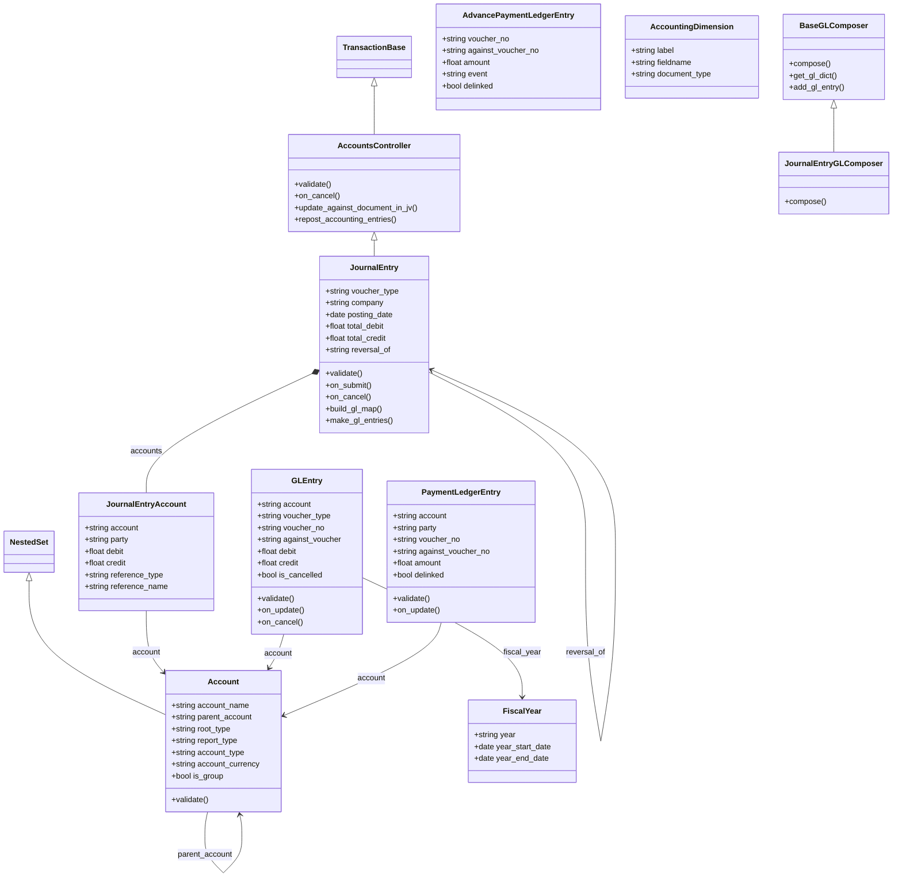
```mermaid
classDiagram
    class TransactionBase
    class AccountsController {
        +validate()
        +on_cancel()
        +update_against_document_in_jv()
        +repost_accounting_entries()
    }
    class NestedSet
    class Account {
        +string account_name
        +string parent_account
        +string root_type
        +string report_type
        +string account_type
        +string account_currency
        +bool is_group
        +validate()
    }
    class GLEntry {
        +string account
        +string voucher_type
        +string voucher_no
        +string against_voucher
        +float debit
        +float credit
        +bool is_cancelled
        +validate()
        +on_update()
        +on_cancel()
    }
    class PaymentLedgerEntry {
        +string account
        +string party
        +string voucher_no
        +string against_voucher_no
        +float amount
        +bool delinked
        +validate()
        +on_update()
    }
    class AdvancePaymentLedgerEntry {
        +string voucher_no
        +string against_voucher_no
        +float amount
        +string event
        +bool delinked
    }
    class JournalEntry {
        +string voucher_type
        +string company
        +date posting_date
        +float total_debit
        +float total_credit
        +string reversal_of
        +validate()
        +on_submit()
        +on_cancel()
        +build_gl_map()
        +make_gl_entries()
    }
    class JournalEntryAccount {
        +string account
        +string party
        +float debit
        +float credit
        +string reference_type
        +string reference_name
    }
    class FiscalYear {
        +string year
        +date year_start_date
        +date year_end_date
    }
    class AccountingDimension {
        +string label
        +string fieldname
        +string document_type
    }
    class BaseGLComposer {
        +compose()
        +get_gl_dict()
        +add_gl_entry()
    }
    class JournalEntryGLComposer {
        +compose()
    }
    AccountsController <|-- JournalEntry
    TransactionBase <|-- AccountsController
    NestedSet <|-- Account
    BaseGLComposer <|-- JournalEntryGLComposer
    JournalEntry *-- JournalEntryAccount : accounts
    JournalEntry --> JournalEntry : reversal_of
    JournalEntryAccount --> Account : account
    GLEntry --> Account : account
    GLEntry --> FiscalYear : fiscal_year
    PaymentLedgerEntry --> Account : account
    Account --> Account : parent_account
```

### Hóa đơn bán và mua

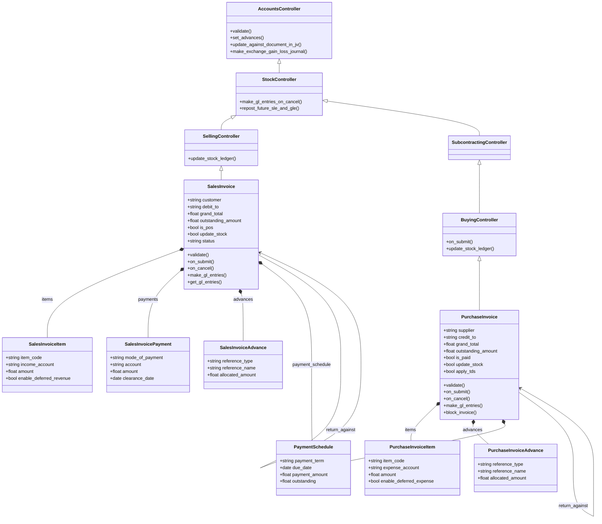
```mermaid
classDiagram
    class AccountsController {
        +validate()
        +set_advances()
        +update_against_document_in_jv()
        +make_exchange_gain_loss_journal()
    }
    class StockController {
        +make_gl_entries_on_cancel()
        +repost_future_sle_and_gle()
    }
    class SubcontractingController
    class SellingController {
        +update_stock_ledger()
    }
    class BuyingController {
        +on_submit()
        +update_stock_ledger()
    }
    class SalesInvoice {
        +string customer
        +string debit_to
        +float grand_total
        +float outstanding_amount
        +bool is_pos
        +bool update_stock
        +string status
        +validate()
        +on_submit()
        +on_cancel()
        +make_gl_entries()
        +get_gl_entries()
    }
    class SalesInvoiceItem {
        +string item_code
        +string income_account
        +float amount
        +bool enable_deferred_revenue
    }
    class SalesInvoicePayment {
        +string mode_of_payment
        +string account
        +float amount
        +date clearance_date
    }
    class SalesInvoiceAdvance {
        +string reference_type
        +string reference_name
        +float allocated_amount
    }
    class PurchaseInvoice {
        +string supplier
        +string credit_to
        +float grand_total
        +float outstanding_amount
        +bool is_paid
        +bool update_stock
        +bool apply_tds
        +validate()
        +on_submit()
        +on_cancel()
        +make_gl_entries()
        +block_invoice()
    }
    class PurchaseInvoiceItem {
        +string item_code
        +string expense_account
        +float amount
        +bool enable_deferred_expense
    }
    class PurchaseInvoiceAdvance {
        +string reference_type
        +string reference_name
        +float allocated_amount
    }
    class PaymentSchedule {
        +string payment_term
        +date due_date
        +float payment_amount
        +float outstanding
    }
    AccountsController <|-- StockController
    StockController <|-- SellingController
    StockController <|-- SubcontractingController
    SubcontractingController <|-- BuyingController
    SellingController <|-- SalesInvoice
    BuyingController <|-- PurchaseInvoice
    SalesInvoice *-- SalesInvoiceItem : items
    SalesInvoice *-- SalesInvoicePayment : payments
    SalesInvoice *-- SalesInvoiceAdvance : advances
    SalesInvoice *-- PaymentSchedule : payment_schedule
    SalesInvoice --> SalesInvoice : return_against
    PurchaseInvoice *-- PurchaseInvoiceItem : items
    PurchaseInvoice *-- PurchaseInvoiceAdvance : advances
    PurchaseInvoice *-- PaymentSchedule : payment_schedule
    PurchaseInvoice --> PurchaseInvoice : return_against
```

### Thanh toán

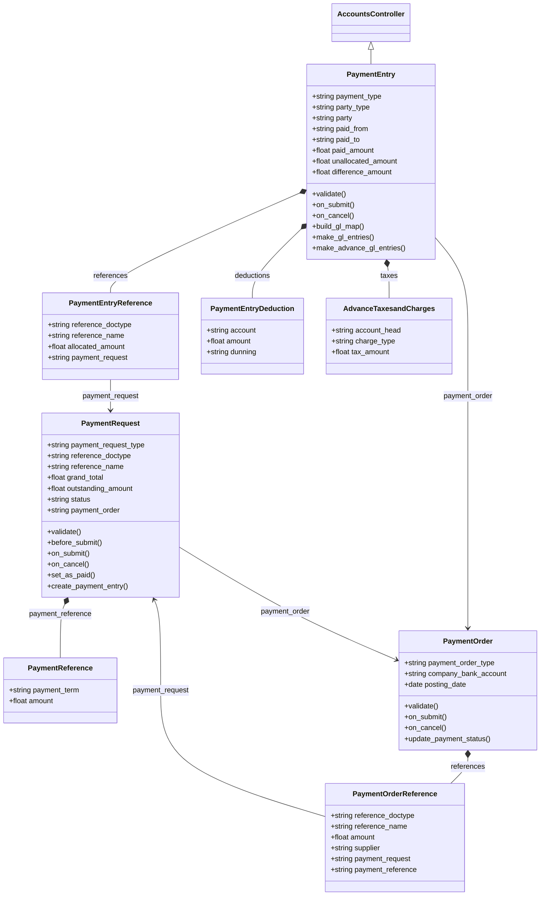
```mermaid
classDiagram
    class AccountsController
    class PaymentEntry {
        +string payment_type
        +string party_type
        +string party
        +string paid_from
        +string paid_to
        +float paid_amount
        +float unallocated_amount
        +float difference_amount
        +validate()
        +on_submit()
        +on_cancel()
        +build_gl_map()
        +make_gl_entries()
        +make_advance_gl_entries()
    }
    class PaymentEntryReference {
        +string reference_doctype
        +string reference_name
        +float allocated_amount
        +string payment_request
    }
    class PaymentEntryDeduction {
        +string account
        +float amount
        +string dunning
    }
    class AdvanceTaxesandCharges {
        +string account_head
        +string charge_type
        +float tax_amount
    }
    class PaymentRequest {
        +string payment_request_type
        +string reference_doctype
        +string reference_name
        +float grand_total
        +float outstanding_amount
        +string status
        +string payment_order
        +validate()
        +before_submit()
        +on_submit()
        +on_cancel()
        +set_as_paid()
        +create_payment_entry()
    }
    class PaymentReference {
        +string payment_term
        +float amount
    }
    class PaymentOrder {
        +string payment_order_type
        +string company_bank_account
        +date posting_date
        +validate()
        +on_submit()
        +on_cancel()
        +update_payment_status()
    }
    class PaymentOrderReference {
        +string reference_doctype
        +string reference_name
        +float amount
        +string supplier
        +string payment_request
        +string payment_reference
    }
    AccountsController <|-- PaymentEntry
    PaymentEntry *-- PaymentEntryReference : references
    PaymentEntry *-- PaymentEntryDeduction : deductions
    PaymentEntry *-- AdvanceTaxesandCharges : taxes
    PaymentEntry --> PaymentOrder : payment_order
    PaymentEntryReference --> PaymentRequest : payment_request
    PaymentRequest *-- PaymentReference : payment_reference
    PaymentRequest --> PaymentOrder : payment_order
    PaymentOrder *-- PaymentOrderReference : references
    PaymentOrderReference --> PaymentRequest : payment_request
```

### Đối trừ

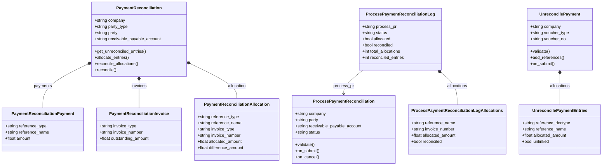
```mermaid
classDiagram
    class PaymentReconciliation {
        +string company
        +string party_type
        +string party
        +string receivable_payable_account
        +get_unreconciled_entries()
        +allocate_entries()
        +reconcile_allocations()
        +reconcile()
    }
    class PaymentReconciliationPayment {
        +string reference_type
        +string reference_name
        +float amount
    }
    class PaymentReconciliationInvoice {
        +string invoice_type
        +string invoice_number
        +float outstanding_amount
    }
    class PaymentReconciliationAllocation {
        +string reference_type
        +string reference_name
        +string invoice_type
        +string invoice_number
        +float allocated_amount
        +float difference_amount
    }
    class ProcessPaymentReconciliation {
        +string company
        +string party
        +string receivable_payable_account
        +string status
        +validate()
        +on_submit()
        +on_cancel()
    }
    class ProcessPaymentReconciliationLog {
        +string process_pr
        +string status
        +bool allocated
        +bool reconciled
        +int total_allocations
        +int reconciled_entries
    }
    class ProcessPaymentReconciliationLogAllocations {
        +string reference_name
        +string invoice_number
        +float allocated_amount
        +bool reconciled
    }
    class UnreconcilePayment {
        +string company
        +string voucher_type
        +string voucher_no
        +validate()
        +add_references()
        +on_submit()
    }
    class UnreconcilePaymentEntries {
        +string reference_doctype
        +string reference_name
        +float allocated_amount
        +bool unlinked
    }
    PaymentReconciliation *-- PaymentReconciliationPayment : payments
    PaymentReconciliation *-- PaymentReconciliationInvoice : invoices
    PaymentReconciliation *-- PaymentReconciliationAllocation : allocation
    ProcessPaymentReconciliationLog --> ProcessPaymentReconciliation : process_pr
    ProcessPaymentReconciliationLog *-- ProcessPaymentReconciliationLogAllocations : allocations
    UnreconcilePayment *-- UnreconcilePaymentEntries : allocations
```

### Ngân hàng

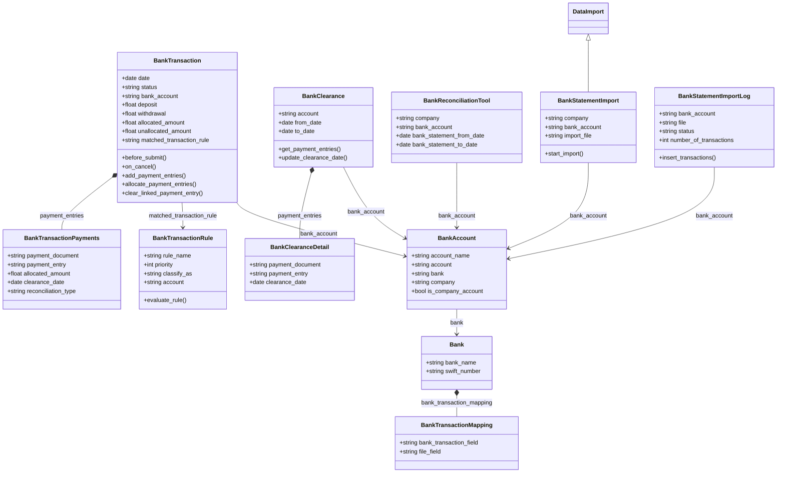
```mermaid
classDiagram
    class DataImport
    class Bank {
        +string bank_name
        +string swift_number
    }
    class BankTransactionMapping {
        +string bank_transaction_field
        +string file_field
    }
    class BankAccount {
        +string account_name
        +string account
        +string bank
        +string company
        +bool is_company_account
    }
    class BankTransaction {
        +date date
        +string status
        +string bank_account
        +float deposit
        +float withdrawal
        +float allocated_amount
        +float unallocated_amount
        +string matched_transaction_rule
        +before_submit()
        +on_cancel()
        +add_payment_entries()
        +allocate_payment_entries()
        +clear_linked_payment_entry()
    }
    class BankTransactionPayments {
        +string payment_document
        +string payment_entry
        +float allocated_amount
        +date clearance_date
        +string reconciliation_type
    }
    class BankClearance {
        +string account
        +date from_date
        +date to_date
        +get_payment_entries()
        +update_clearance_date()
    }
    class BankClearanceDetail {
        +string payment_document
        +string payment_entry
        +date clearance_date
    }
    class BankReconciliationTool {
        +string company
        +string bank_account
        +date bank_statement_from_date
        +date bank_statement_to_date
    }
    class BankStatementImport {
        +string company
        +string bank_account
        +string import_file
        +start_import()
    }
    class BankStatementImportLog {
        +string bank_account
        +string file
        +string status
        +int number_of_transactions
        +insert_transactions()
    }
    class BankTransactionRule {
        +string rule_name
        +int priority
        +string classify_as
        +string account
        +evaluate_rule()
    }
    DataImport <|-- BankStatementImport
    Bank *-- BankTransactionMapping : bank_transaction_mapping
    BankAccount --> Bank : bank
    BankTransaction --> BankAccount : bank_account
    BankTransaction --> BankTransactionRule : matched_transaction_rule
    BankTransaction *-- BankTransactionPayments : payment_entries
    BankClearance --> BankAccount : bank_account
    BankClearance *-- BankClearanceDetail : payment_entries
    BankReconciliationTool --> BankAccount : bank_account
    BankStatementImport --> BankAccount : bank_account
    BankStatementImportLog --> BankAccount : bank_account
```

### Thuế

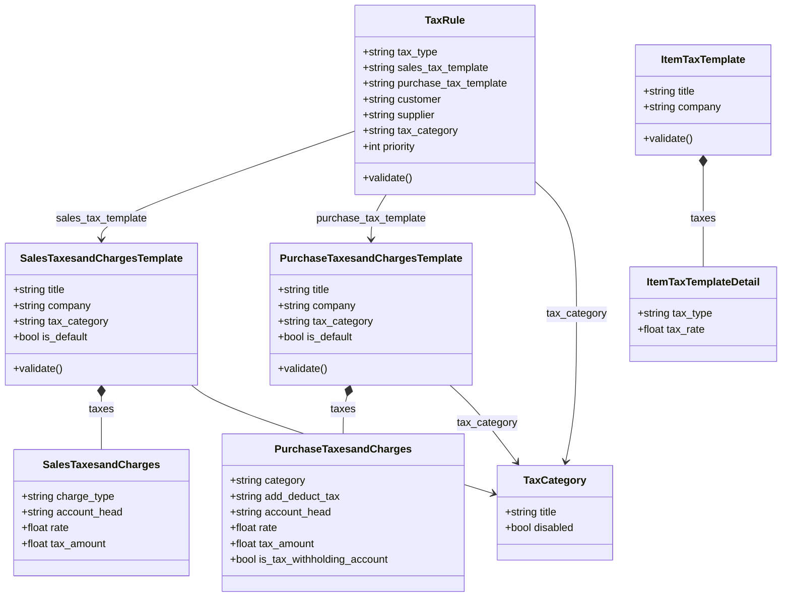
```mermaid
classDiagram
    class SalesTaxesandChargesTemplate {
        +string title
        +string company
        +string tax_category
        +bool is_default
        +validate()
    }
    class SalesTaxesandCharges {
        +string charge_type
        +string account_head
        +float rate
        +float tax_amount
    }
    class PurchaseTaxesandChargesTemplate {
        +string title
        +string company
        +string tax_category
        +bool is_default
        +validate()
    }
    class PurchaseTaxesandCharges {
        +string category
        +string add_deduct_tax
        +string account_head
        +float rate
        +float tax_amount
        +bool is_tax_withholding_account
    }
    class ItemTaxTemplate {
        +string title
        +string company
        +validate()
    }
    class ItemTaxTemplateDetail {
        +string tax_type
        +float tax_rate
    }
    class TaxRule {
        +string tax_type
        +string sales_tax_template
        +string purchase_tax_template
        +string customer
        +string supplier
        +string tax_category
        +int priority
        +validate()
    }
    class TaxCategory {
        +string title
        +bool disabled
    }
    SalesTaxesandChargesTemplate *-- SalesTaxesandCharges : taxes
    SalesTaxesandChargesTemplate --> TaxCategory : tax_category
    PurchaseTaxesandChargesTemplate *-- PurchaseTaxesandCharges : taxes
    PurchaseTaxesandChargesTemplate --> TaxCategory : tax_category
    ItemTaxTemplate *-- ItemTaxTemplateDetail : taxes
    TaxRule --> SalesTaxesandChargesTemplate : sales_tax_template
    TaxRule --> PurchaseTaxesandChargesTemplate : purchase_tax_template
    TaxRule --> TaxCategory : tax_category
```

### Thuế khấu trừ

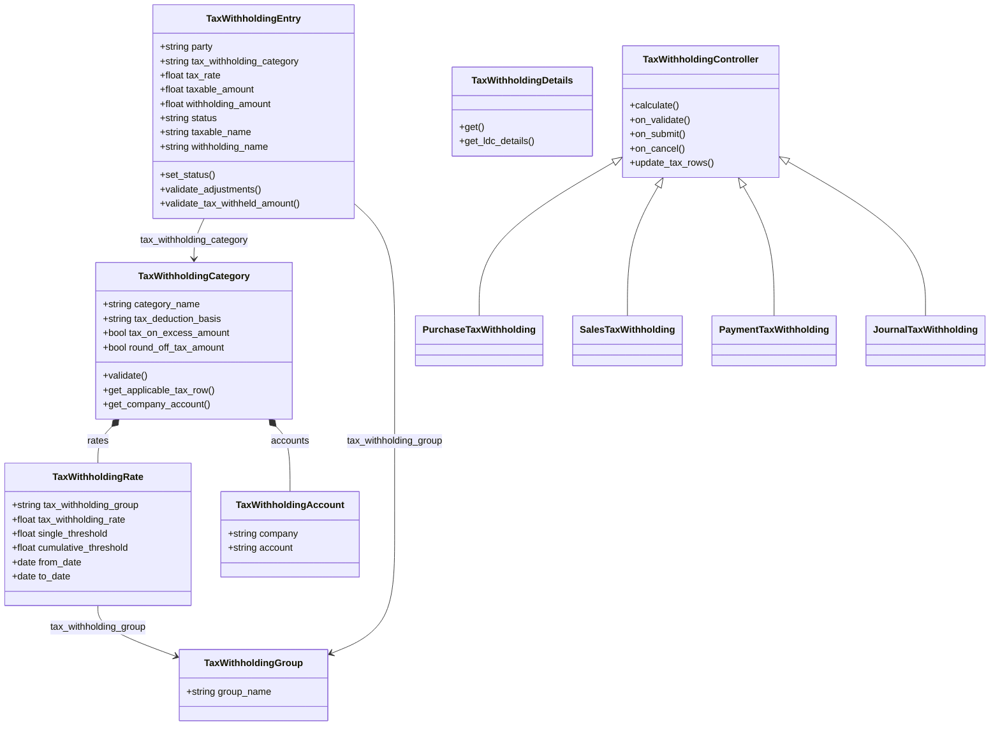
```mermaid
classDiagram
    class TaxWithholdingCategory {
        +string category_name
        +string tax_deduction_basis
        +bool tax_on_excess_amount
        +bool round_off_tax_amount
        +validate()
        +get_applicable_tax_row()
        +get_company_account()
    }
    class TaxWithholdingRate {
        +string tax_withholding_group
        +float tax_withholding_rate
        +float single_threshold
        +float cumulative_threshold
        +date from_date
        +date to_date
    }
    class TaxWithholdingAccount {
        +string company
        +string account
    }
    class TaxWithholdingGroup {
        +string group_name
    }
    class TaxWithholdingEntry {
        +string party
        +string tax_withholding_category
        +float tax_rate
        +float taxable_amount
        +float withholding_amount
        +string status
        +string taxable_name
        +string withholding_name
        +set_status()
        +validate_adjustments()
        +validate_tax_withheld_amount()
    }
    class TaxWithholdingDetails {
        +get()
        +get_ldc_details()
    }
    class TaxWithholdingController {
        +calculate()
        +on_validate()
        +on_submit()
        +on_cancel()
        +update_tax_rows()
    }
    class PurchaseTaxWithholding
    class SalesTaxWithholding
    class PaymentTaxWithholding
    class JournalTaxWithholding
    TaxWithholdingController <|-- PurchaseTaxWithholding
    TaxWithholdingController <|-- SalesTaxWithholding
    TaxWithholdingController <|-- PaymentTaxWithholding
    TaxWithholdingController <|-- JournalTaxWithholding
    TaxWithholdingCategory *-- TaxWithholdingRate : rates
    TaxWithholdingCategory *-- TaxWithholdingAccount : accounts
    TaxWithholdingRate --> TaxWithholdingGroup : tax_withholding_group
    TaxWithholdingEntry --> TaxWithholdingCategory : tax_withholding_category
    TaxWithholdingEntry --> TaxWithholdingGroup : tax_withholding_group
```

### Ngân sách và cost center

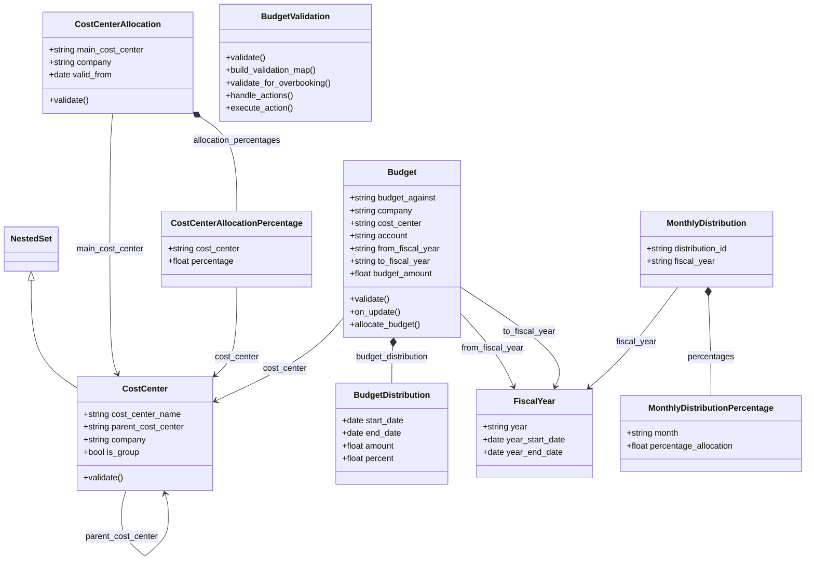
```mermaid
classDiagram
    class NestedSet
    class CostCenter {
        +string cost_center_name
        +string parent_cost_center
        +string company
        +bool is_group
        +validate()
    }
    class CostCenterAllocation {
        +string main_cost_center
        +string company
        +date valid_from
        +validate()
    }
    class CostCenterAllocationPercentage {
        +string cost_center
        +float percentage
    }
    class Budget {
        +string budget_against
        +string company
        +string cost_center
        +string account
        +string from_fiscal_year
        +string to_fiscal_year
        +float budget_amount
        +validate()
        +on_update()
        +allocate_budget()
    }
    class BudgetDistribution {
        +date start_date
        +date end_date
        +float amount
        +float percent
    }
    class FiscalYear {
        +string year
        +date year_start_date
        +date year_end_date
    }
    class MonthlyDistribution {
        +string distribution_id
        +string fiscal_year
    }
    class MonthlyDistributionPercentage {
        +string month
        +float percentage_allocation
    }
    class BudgetValidation {
        +validate()
        +build_validation_map()
        +validate_for_overbooking()
        +handle_actions()
        +execute_action()
    }
    NestedSet <|-- CostCenter
    CostCenter --> CostCenter : parent_cost_center
    CostCenterAllocation --> CostCenter : main_cost_center
    CostCenterAllocation *-- CostCenterAllocationPercentage : allocation_percentages
    CostCenterAllocationPercentage --> CostCenter : cost_center
    Budget --> CostCenter : cost_center
    Budget --> FiscalYear : from_fiscal_year
    Budget --> FiscalYear : to_fiscal_year
    Budget *-- BudgetDistribution : budget_distribution
    MonthlyDistribution --> FiscalYear : fiscal_year
    MonthlyDistribution *-- MonthlyDistributionPercentage : percentages
```

### Khóa sổ

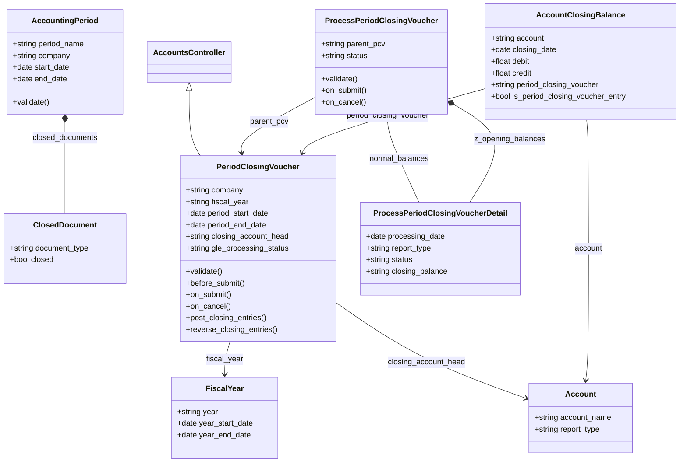
```mermaid
classDiagram
    class AccountsController
    class FiscalYear {
        +string year
        +date year_start_date
        +date year_end_date
    }
    class AccountingPeriod {
        +string period_name
        +string company
        +date start_date
        +date end_date
        +validate()
    }
    class ClosedDocument {
        +string document_type
        +bool closed
    }
    class Account {
        +string account_name
        +string report_type
    }
    class PeriodClosingVoucher {
        +string company
        +string fiscal_year
        +date period_start_date
        +date period_end_date
        +string closing_account_head
        +string gle_processing_status
        +validate()
        +before_submit()
        +on_submit()
        +on_cancel()
        +post_closing_entries()
        +reverse_closing_entries()
    }
    class ProcessPeriodClosingVoucher {
        +string parent_pcv
        +string status
        +validate()
        +on_submit()
        +on_cancel()
    }
    class ProcessPeriodClosingVoucherDetail {
        +date processing_date
        +string report_type
        +string status
        +string closing_balance
    }
    class AccountClosingBalance {
        +string account
        +date closing_date
        +float debit
        +float credit
        +string period_closing_voucher
        +bool is_period_closing_voucher_entry
    }
    AccountsController <|-- PeriodClosingVoucher
    AccountingPeriod *-- ClosedDocument : closed_documents
    PeriodClosingVoucher --> FiscalYear : fiscal_year
    PeriodClosingVoucher --> Account : closing_account_head
    ProcessPeriodClosingVoucher --> PeriodClosingVoucher : parent_pcv
    ProcessPeriodClosingVoucher *-- ProcessPeriodClosingVoucherDetail : normal_balances
    ProcessPeriodClosingVoucher *-- ProcessPeriodClosingVoucherDetail : z_opening_balances
    AccountClosingBalance --> Account : account
    AccountClosingBalance --> PeriodClosingVoucher : period_closing_voucher
```

### Tỷ giá và trả trước

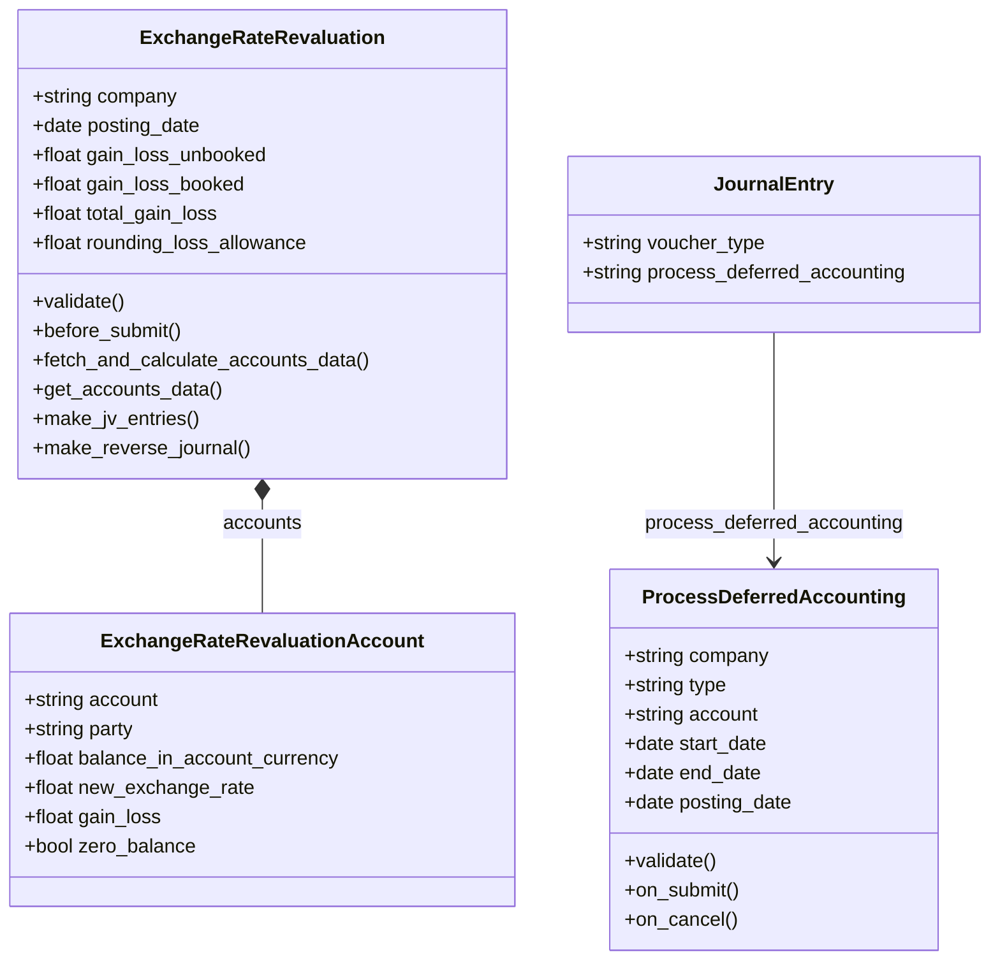
```mermaid
classDiagram
    class ExchangeRateRevaluation {
        +string company
        +date posting_date
        +float gain_loss_unbooked
        +float gain_loss_booked
        +float total_gain_loss
        +float rounding_loss_allowance
        +validate()
        +before_submit()
        +fetch_and_calculate_accounts_data()
        +get_accounts_data()
        +make_jv_entries()
        +make_reverse_journal()
    }
    class ExchangeRateRevaluationAccount {
        +string account
        +string party
        +float balance_in_account_currency
        +float new_exchange_rate
        +float gain_loss
        +bool zero_balance
    }
    class ProcessDeferredAccounting {
        +string company
        +string type
        +string account
        +date start_date
        +date end_date
        +date posting_date
        +validate()
        +on_submit()
        +on_cancel()
    }
    class JournalEntry {
        +string voucher_type
        +string process_deferred_accounting
    }
    ExchangeRateRevaluation *-- ExchangeRateRevaluationAccount : accounts
    JournalEntry --> ProcessDeferredAccounting : process_deferred_accounting
```

### POS

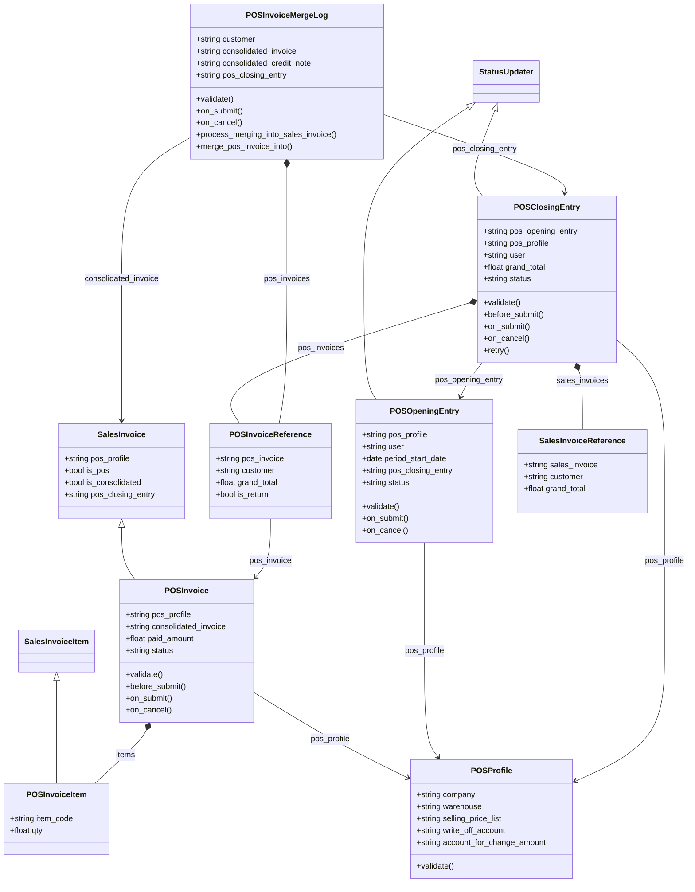
```mermaid
classDiagram
    class StatusUpdater
    class SalesInvoice {
        +string pos_profile
        +bool is_pos
        +bool is_consolidated
        +string pos_closing_entry
    }
    class SalesInvoiceItem
    class POSProfile {
        +string company
        +string warehouse
        +string selling_price_list
        +string write_off_account
        +string account_for_change_amount
        +validate()
    }
    class POSOpeningEntry {
        +string pos_profile
        +string user
        +date period_start_date
        +string pos_closing_entry
        +string status
        +validate()
        +on_submit()
        +on_cancel()
    }
    class POSInvoice {
        +string pos_profile
        +string consolidated_invoice
        +float paid_amount
        +string status
        +validate()
        +before_submit()
        +on_submit()
        +on_cancel()
    }
    class POSInvoiceItem {
        +string item_code
        +float qty
    }
    class POSClosingEntry {
        +string pos_opening_entry
        +string pos_profile
        +string user
        +float grand_total
        +string status
        +validate()
        +before_submit()
        +on_submit()
        +on_cancel()
        +retry()
    }
    class POSInvoiceMergeLog {
        +string customer
        +string consolidated_invoice
        +string consolidated_credit_note
        +string pos_closing_entry
        +validate()
        +on_submit()
        +on_cancel()
        +process_merging_into_sales_invoice()
        +merge_pos_invoice_into()
    }
    class POSInvoiceReference {
        +string pos_invoice
        +string customer
        +float grand_total
        +bool is_return
    }
    class SalesInvoiceReference {
        +string sales_invoice
        +string customer
        +float grand_total
    }
    SalesInvoice <|-- POSInvoice
    SalesInvoiceItem <|-- POSInvoiceItem
    StatusUpdater <|-- POSOpeningEntry
    StatusUpdater <|-- POSClosingEntry
    POSInvoice *-- POSInvoiceItem : items
    POSInvoice --> POSProfile : pos_profile
    POSOpeningEntry --> POSProfile : pos_profile
    POSClosingEntry --> POSProfile : pos_profile
    POSClosingEntry --> POSOpeningEntry : pos_opening_entry
    POSClosingEntry *-- POSInvoiceReference : pos_invoices
    POSClosingEntry *-- SalesInvoiceReference : sales_invoices
    POSInvoiceMergeLog *-- POSInvoiceReference : pos_invoices
    POSInvoiceMergeLog --> SalesInvoice : consolidated_invoice
    POSInvoiceMergeLog --> POSClosingEntry : pos_closing_entry
    POSInvoiceReference --> POSInvoice : pos_invoice
```

### Pricing Rule và Loyalty

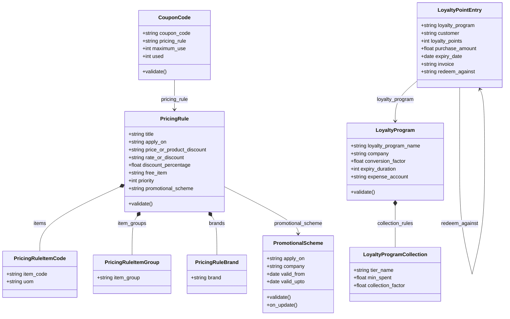
```mermaid
classDiagram
    class PricingRule {
        +string title
        +string apply_on
        +string price_or_product_discount
        +string rate_or_discount
        +float discount_percentage
        +string free_item
        +int priority
        +string promotional_scheme
        +validate()
    }
    class PricingRuleItemCode {
        +string item_code
        +string uom
    }
    class PricingRuleItemGroup {
        +string item_group
    }
    class PricingRuleBrand {
        +string brand
    }
    class PromotionalScheme {
        +string apply_on
        +string company
        +date valid_from
        +date valid_upto
        +validate()
        +on_update()
    }
    class CouponCode {
        +string coupon_code
        +string pricing_rule
        +int maximum_use
        +int used
        +validate()
    }
    class LoyaltyProgram {
        +string loyalty_program_name
        +string company
        +float conversion_factor
        +int expiry_duration
        +string expense_account
        +validate()
    }
    class LoyaltyProgramCollection {
        +string tier_name
        +float min_spent
        +float collection_factor
    }
    class LoyaltyPointEntry {
        +string loyalty_program
        +string customer
        +int loyalty_points
        +float purchase_amount
        +date expiry_date
        +string invoice
        +string redeem_against
    }
    PricingRule *-- PricingRuleItemCode : items
    PricingRule *-- PricingRuleItemGroup : item_groups
    PricingRule *-- PricingRuleBrand : brands
    PricingRule --> PromotionalScheme : promotional_scheme
    CouponCode --> PricingRule : pricing_rule
    LoyaltyProgram *-- LoyaltyProgramCollection : collection_rules
    LoyaltyPointEntry --> LoyaltyProgram : loyalty_program
    LoyaltyPointEntry --> LoyaltyPointEntry : redeem_against
```

### Subscription và Dunning

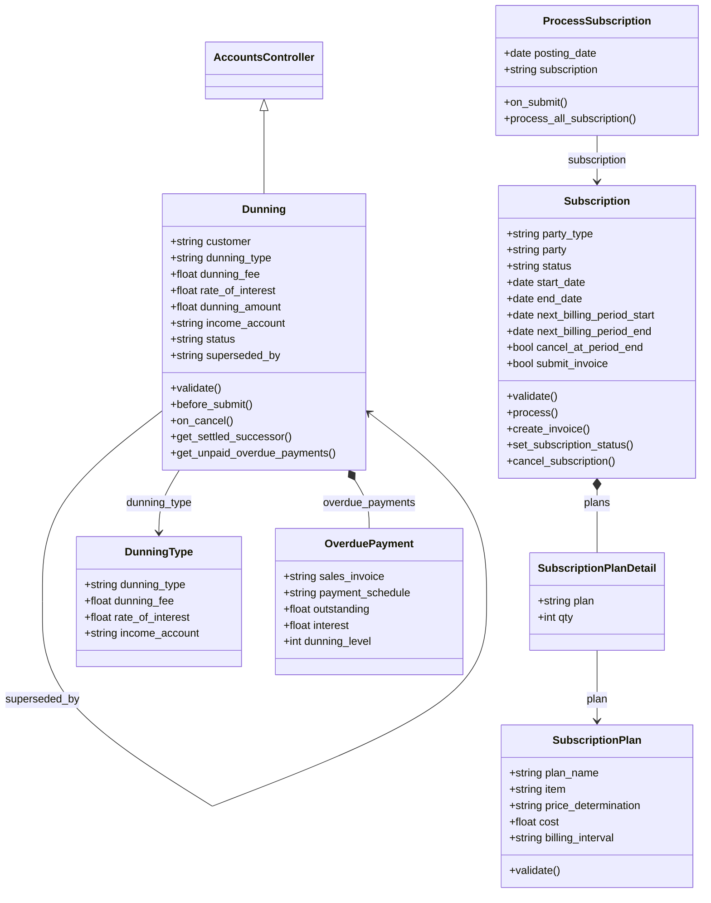
```mermaid
classDiagram
    class AccountsController
    class Subscription {
        +string party_type
        +string party
        +string status
        +date start_date
        +date end_date
        +date next_billing_period_start
        +date next_billing_period_end
        +bool cancel_at_period_end
        +bool submit_invoice
        +validate()
        +process()
        +create_invoice()
        +set_subscription_status()
        +cancel_subscription()
    }
    class SubscriptionPlanDetail {
        +string plan
        +int qty
    }
    class SubscriptionPlan {
        +string plan_name
        +string item
        +string price_determination
        +float cost
        +string billing_interval
        +validate()
    }
    class ProcessSubscription {
        +date posting_date
        +string subscription
        +on_submit()
        +process_all_subscription()
    }
    class Dunning {
        +string customer
        +string dunning_type
        +float dunning_fee
        +float rate_of_interest
        +float dunning_amount
        +string income_account
        +string status
        +string superseded_by
        +validate()
        +before_submit()
        +on_cancel()
        +get_settled_successor()
        +get_unpaid_overdue_payments()
    }
    class DunningType {
        +string dunning_type
        +float dunning_fee
        +float rate_of_interest
        +string income_account
    }
    class OverduePayment {
        +string sales_invoice
        +string payment_schedule
        +float outstanding
        +float interest
        +int dunning_level
    }
    Subscription *-- SubscriptionPlanDetail : plans
    SubscriptionPlanDetail --> SubscriptionPlan : plan
    ProcessSubscription --> Subscription : subscription
    AccountsController <|-- Dunning
    Dunning --> DunningType : dunning_type
    Dunning --> Dunning : superseded_by
    Dunning *-- OverduePayment : overdue_payments
```

### Repost và Ledger Health

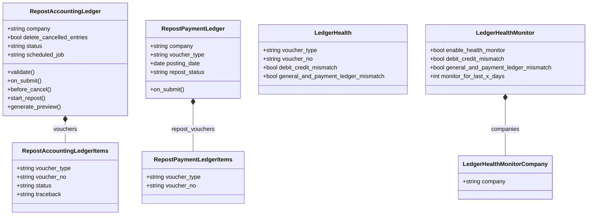
```mermaid
classDiagram
    class RepostAccountingLedger {
        +string company
        +bool delete_cancelled_entries
        +string status
        +string scheduled_job
        +validate()
        +on_submit()
        +before_cancel()
        +start_repost()
        +generate_preview()
    }
    class RepostAccountingLedgerItems {
        +string voucher_type
        +string voucher_no
        +string status
        +string traceback
    }
    class RepostPaymentLedger {
        +string company
        +string voucher_type
        +date posting_date
        +string repost_status
        +on_submit()
    }
    class RepostPaymentLedgerItems {
        +string voucher_type
        +string voucher_no
    }
    class LedgerHealth {
        +string voucher_type
        +string voucher_no
        +bool debit_credit_mismatch
        +bool general_and_payment_ledger_mismatch
    }
    class LedgerHealthMonitor {
        +bool enable_health_monitor
        +bool debit_credit_mismatch
        +bool general_and_payment_ledger_mismatch
        +int monitor_for_last_x_days
    }
    class LedgerHealthMonitorCompany {
        +string company
    }
    RepostAccountingLedger *-- RepostAccountingLedgerItems : vouchers
    RepostPaymentLedger *-- RepostPaymentLedgerItems : repost_vouchers
    LedgerHealthMonitor *-- LedgerHealthMonitorCompany : companies
```

## Sequence diagram

### Journal Entry submit và lõi ghi sổ

Submit Journal Entry, đi qua `make_gl_entries`, là đường ghi sổ mà mọi chứng từ khác dùng chung. Khi `cancel=1` thì đi nhánh đảo bút toán.

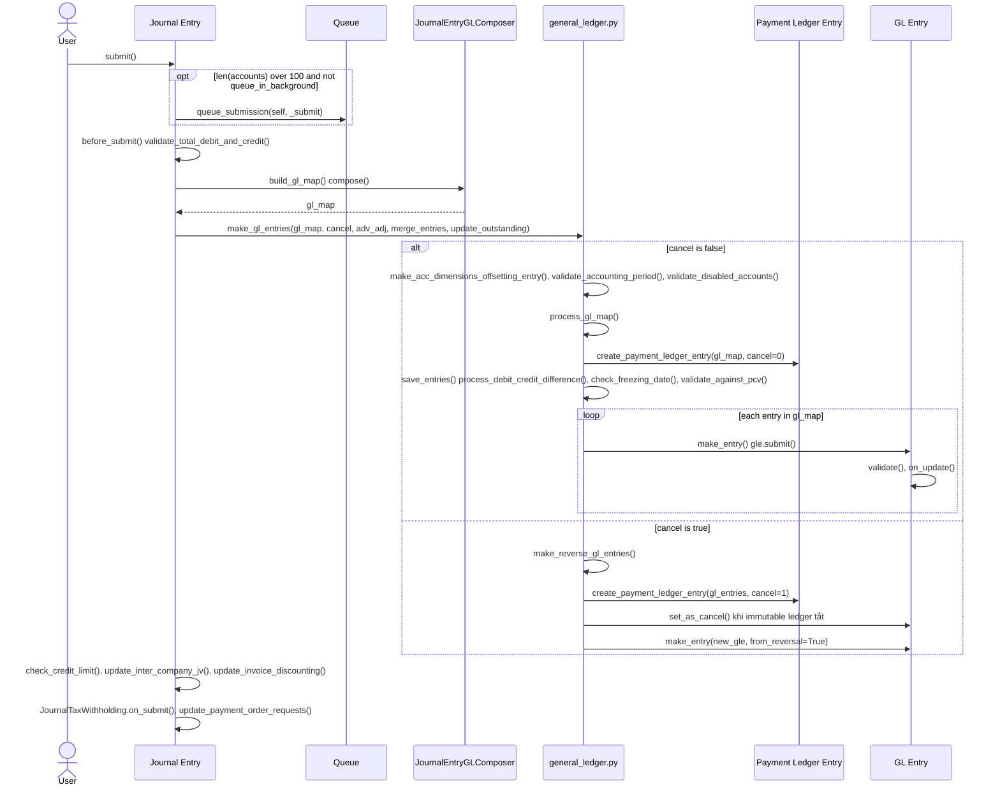
```mermaid
sequenceDiagram
    actor User
    participant JE as Journal Entry
    participant Q as Queue
    participant Composer as JournalEntryGLComposer
    participant GL as general_ledger.py
    participant PLE as Payment Ledger Entry
    participant GLE as GL Entry
    User->>JE: submit()
    opt len(accounts) over 100 and not queue_in_background
        JE->>Q: queue_submission(self, _submit)
    end
    JE->>JE: before_submit() validate_total_debit_and_credit()
    JE->>Composer: build_gl_map() compose()
    Composer-->>JE: gl_map
    JE->>GL: make_gl_entries(gl_map, cancel, adv_adj, merge_entries, update_outstanding)
    alt cancel is false
        GL->>GL: make_acc_dimensions_offsetting_entry(), validate_accounting_period(), validate_disabled_accounts()
        GL->>GL: process_gl_map()
        GL->>PLE: create_payment_ledger_entry(gl_map, cancel=0)
        GL->>GL: save_entries() process_debit_credit_difference(), check_freezing_date(), validate_against_pcv()
        loop each entry in gl_map
            GL->>GLE: make_entry() gle.submit()
            GLE->>GLE: validate(), on_update()
        end
    else cancel is true
        GL->>GL: make_reverse_gl_entries()
        GL->>PLE: create_payment_ledger_entry(gl_entries, cancel=1)
        GL->>GLE: set_as_cancel() khi immutable ledger tắt
        GL->>GLE: make_entry(new_gle, from_reversal=True)
    end
    JE->>JE: check_credit_limit(), update_inter_company_jv(), update_invoice_discounting()
    JE->>JE: JournalTaxWithholding.on_submit(), update_payment_order_requests()
```

Nguồn: [journal_entry.py:241](../../apps/erpnext/erpnext/accounts/doctype/journal_entry/journal_entry.py#L241), [general_ledger.py:34](../../apps/erpnext/erpnext/accounts/general_ledger.py#L34), [general_ledger.py:647](../../apps/erpnext/erpnext/accounts/general_ledger.py#L647)

### Sales Invoice submit

Submit hóa đơn bán: cập nhật chứng từ nguồn, ghi kho nếu có `update_stock`, ghi GL, đối trừ tạm ứng và xử lý điểm Loyalty.

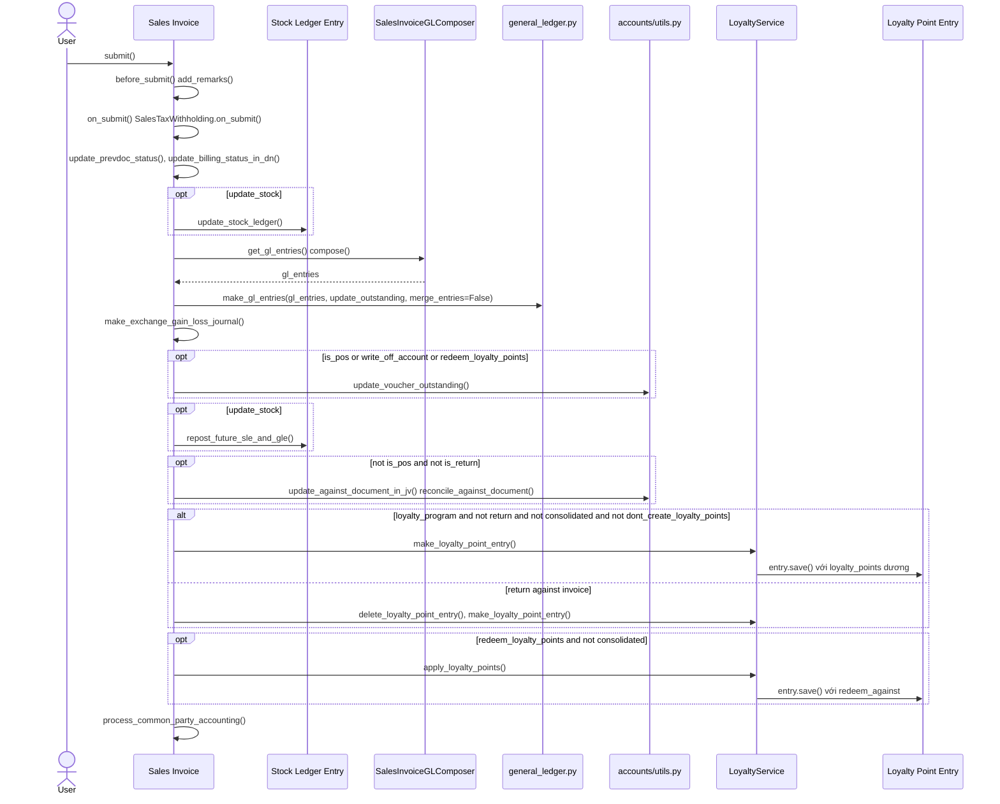
```mermaid
sequenceDiagram
    actor User
    participant SI as Sales Invoice
    participant SLE as Stock Ledger Entry
    participant Composer as SalesInvoiceGLComposer
    participant GL as general_ledger.py
    participant Utils as accounts/utils.py
    participant LS as LoyaltyService
    participant LPE as Loyalty Point Entry
    User->>SI: submit()
    SI->>SI: before_submit() add_remarks()
    SI->>SI: on_submit() SalesTaxWithholding.on_submit()
    SI->>SI: update_prevdoc_status(), update_billing_status_in_dn()
    opt update_stock
        SI->>SLE: update_stock_ledger()
    end
    SI->>Composer: get_gl_entries() compose()
    Composer-->>SI: gl_entries
    SI->>GL: make_gl_entries(gl_entries, update_outstanding, merge_entries=False)
    SI->>SI: make_exchange_gain_loss_journal()
    opt is_pos or write_off_account or redeem_loyalty_points
        SI->>Utils: update_voucher_outstanding()
    end
    opt update_stock
        SI->>SLE: repost_future_sle_and_gle()
    end
    opt not is_pos and not is_return
        SI->>Utils: update_against_document_in_jv() reconcile_against_document()
    end
    alt loyalty_program and not return and not consolidated and not dont_create_loyalty_points
        SI->>LS: make_loyalty_point_entry()
        LS->>LPE: entry.save() với loyalty_points dương
    else return against invoice
        SI->>LS: delete_loyalty_point_entry(), make_loyalty_point_entry()
    end
    opt redeem_loyalty_points and not consolidated
        SI->>LS: apply_loyalty_points()
        LS->>LPE: entry.save() với redeem_against
    end
    SI->>SI: process_common_party_accounting()
```

Nguồn: [sales_invoice.py:443](../../apps/erpnext/erpnext/accounts/doctype/sales_invoice/sales_invoice.py#L443), [sales_invoice.py:1135](../../apps/erpnext/erpnext/accounts/doctype/sales_invoice/sales_invoice.py#L1135), [gl_composer.py:22](../../apps/erpnext/erpnext/accounts/doctype/sales_invoice/services/gl_composer.py#L22), [loyalty.py:21](../../apps/erpnext/erpnext/accounts/doctype/sales_invoice/services/loyalty.py#L21)

### Purchase Invoice submit

Submit hóa đơn mua: tạo tài sản từ `BuyingController.on_submit`, đối trừ tạm ứng, ghi kho nếu có `update_stock`, rồi ghi GL.

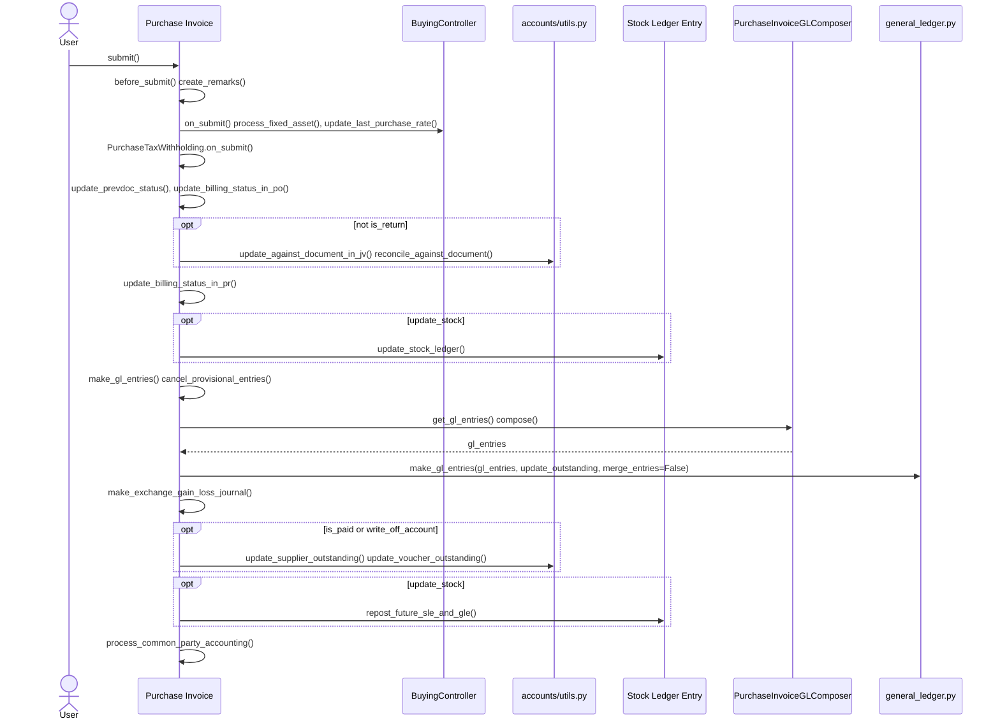
```mermaid
sequenceDiagram
    actor User
    participant PI as Purchase Invoice
    participant BC as BuyingController
    participant Utils as accounts/utils.py
    participant SLE as Stock Ledger Entry
    participant Composer as PurchaseInvoiceGLComposer
    participant GL as general_ledger.py
    User->>PI: submit()
    PI->>PI: before_submit() create_remarks()
    PI->>BC: on_submit() process_fixed_asset(), update_last_purchase_rate()
    PI->>PI: PurchaseTaxWithholding.on_submit()
    PI->>PI: update_prevdoc_status(), update_billing_status_in_po()
    opt not is_return
        PI->>Utils: update_against_document_in_jv() reconcile_against_document()
    end
    PI->>PI: update_billing_status_in_pr()
    opt update_stock
        PI->>SLE: update_stock_ledger()
    end
    PI->>PI: make_gl_entries() cancel_provisional_entries()
    PI->>Composer: get_gl_entries() compose()
    Composer-->>PI: gl_entries
    PI->>GL: make_gl_entries(gl_entries, update_outstanding, merge_entries=False)
    PI->>PI: make_exchange_gain_loss_journal()
    opt is_paid or write_off_account
        PI->>Utils: update_supplier_outstanding() update_voucher_outstanding()
    end
    opt update_stock
        PI->>SLE: repost_future_sle_and_gle()
    end
    PI->>PI: process_common_party_accounting()
```

Nguồn: [purchase_invoice.py:721](../../apps/erpnext/erpnext/accounts/doctype/purchase_invoice/purchase_invoice.py#L721), [purchase_invoice.py:788](../../apps/erpnext/erpnext/accounts/doctype/purchase_invoice/purchase_invoice.py#L788), [gl_composer.py:19](../../apps/erpnext/erpnext/accounts/doctype/purchase_invoice/services/gl_composer.py#L19)

### Payment Entry submit

Submit Payment Entry: giảm công nợ của Payment Request và Payment Schedule, ghi GL, ghi PLE (PLE cập nhật `outstanding_amount` của hóa đơn), rồi làm mới Dunning và Subscription.

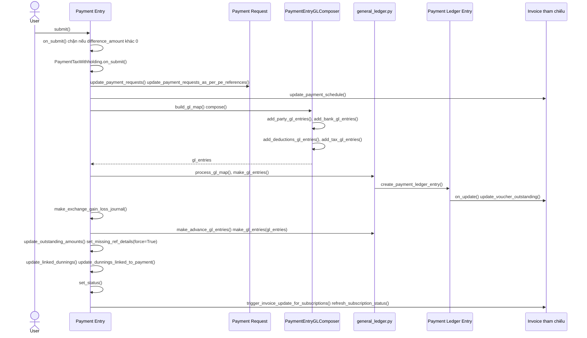
```mermaid
sequenceDiagram
    actor User
    participant PE as Payment Entry
    participant PR as Payment Request
    participant Composer as PaymentEntryGLComposer
    participant GL as general_ledger.py
    participant PLE as Payment Ledger Entry
    participant Inv as Invoice tham chiếu
    User->>PE: submit()
    PE->>PE: on_submit() chặn nếu difference_amount khác 0
    PE->>PE: PaymentTaxWithholding.on_submit()
    PE->>PR: update_payment_requests() update_payment_requests_as_per_pe_references()
    PE->>Inv: update_payment_schedule()
    PE->>Composer: build_gl_map() compose()
    Composer->>Composer: add_party_gl_entries(), add_bank_gl_entries()
    Composer->>Composer: add_deductions_gl_entries(), add_tax_gl_entries()
    Composer-->>PE: gl_entries
    PE->>GL: process_gl_map(), make_gl_entries()
    GL->>PLE: create_payment_ledger_entry()
    PLE->>Inv: on_update() update_voucher_outstanding()
    PE->>PE: make_exchange_gain_loss_journal()
    PE->>GL: make_advance_gl_entries() make_gl_entries(gl_entries)
    PE->>PE: update_outstanding_amounts() set_missing_ref_details(force=True)
    PE->>PE: update_linked_dunnings() update_dunnings_linked_to_payment()
    PE->>PE: set_status()
    PE->>Inv: trigger_invoice_update_for_subscriptions() refresh_subscription_status()
```

Nguồn: [payment_entry.py:266](../../apps/erpnext/erpnext/accounts/doctype/payment_entry/payment_entry.py#L266), [payment_entry.py:1481](../../apps/erpnext/erpnext/accounts/doctype/payment_entry/payment_entry.py#L1481), [gl_composer.py:24](../../apps/erpnext/erpnext/accounts/doctype/payment_entry/services/gl_composer.py#L24), [payment_ledger_entry.py:160](../../apps/erpnext/erpnext/accounts/doctype/payment_ledger_entry/payment_ledger_entry.py#L160)

### Payment Request và Payment Order

Payment Request `Inward` đi qua cổng thanh toán rồi tự tạo Payment Entry. Payment Request `Outward` được gom vào Payment Order, rồi tạo Journal Entry trả nhà cung cấp. Payment Order cũng nhận `payment_order_type` là `Payment Entry` qua `payment_entry.make_payment_order`.

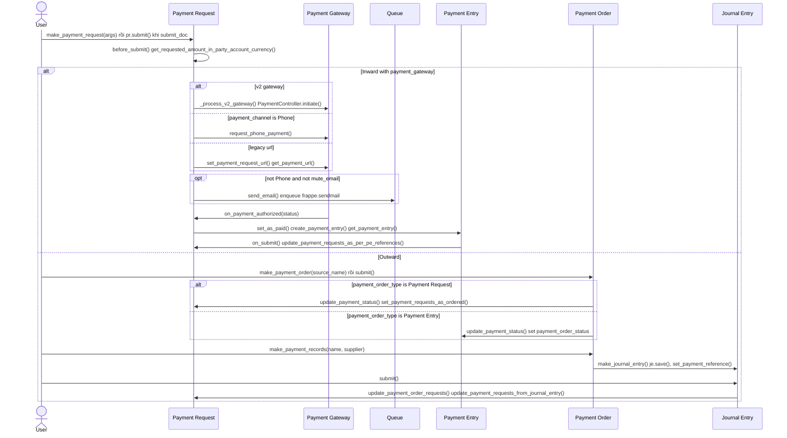
```mermaid
sequenceDiagram
    actor User
    participant PR as Payment Request
    participant GW as Payment Gateway
    participant Q as Queue
    participant PE as Payment Entry
    participant PO as Payment Order
    participant JE as Journal Entry
    User->>PR: make_payment_request(args) rồi pr.submit() khi submit_doc
    PR->>PR: before_submit() get_requested_amount_in_party_account_currency()
    alt Inward with payment_gateway
        alt v2 gateway
            PR->>GW: _process_v2_gateway() PaymentController.initiate()
        else payment_channel is Phone
            PR->>GW: request_phone_payment()
        else legacy url
            PR->>GW: set_payment_request_url() get_payment_url()
        end
        opt not Phone and not mute_email
            PR->>Q: send_email() enqueue frappe.sendmail
        end
        GW->>PR: on_payment_authorized(status)
        PR->>PE: set_as_paid() create_payment_entry() get_payment_entry()
        PE->>PR: on_submit() update_payment_requests_as_per_pe_references()
    else Outward
        User->>PO: make_payment_order(source_name) rồi submit()
        alt payment_order_type is Payment Request
            PO->>PR: update_payment_status() set_payment_requests_as_ordered()
        else payment_order_type is Payment Entry
            PO->>PE: update_payment_status() set payment_order_status
        end
        User->>PO: make_payment_records(name, supplier)
        PO->>JE: make_journal_entry() je.save(), set_payment_reference()
        User->>JE: submit()
        JE->>PR: update_payment_order_requests() update_payment_requests_from_journal_entry()
    end
```

Nguồn: [payment_request.py:845](../../apps/erpnext/erpnext/accounts/doctype/payment_request/payment_request.py#L845), [payment_request.py:336](../../apps/erpnext/erpnext/accounts/doctype/payment_request/payment_request.py#L336), [payment_request.py:613](../../apps/erpnext/erpnext/accounts/doctype/payment_request/payment_request.py#L613), [payment_order.py:285](../../apps/erpnext/erpnext/accounts/doctype/payment_order/payment_order.py#L285)

### Payment Reconciliation thủ công

Người dùng lấy hóa đơn và thanh toán chưa đối trừ, phân bổ, rồi gắn tham chiếu vào Payment Entry/Journal Entry. Credit/Debit Note được đối trừ bằng một Journal Entry mới.

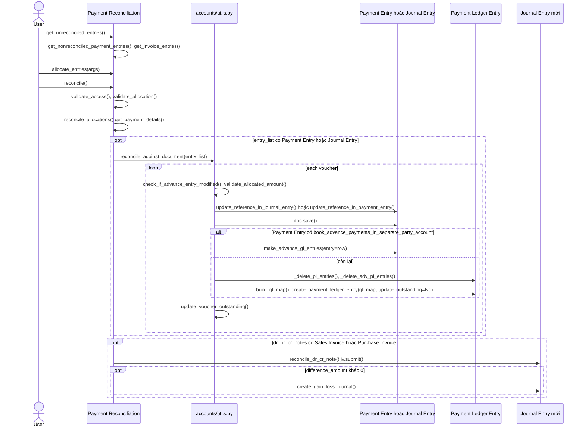
```mermaid
sequenceDiagram
    actor User
    participant PRec as Payment Reconciliation
    participant Utils as accounts/utils.py
    participant V as Payment Entry hoặc Journal Entry
    participant PLE as Payment Ledger Entry
    participant JE as Journal Entry mới
    User->>PRec: get_unreconciled_entries()
    PRec->>PRec: get_nonreconciled_payment_entries(), get_invoice_entries()
    User->>PRec: allocate_entries(args)
    User->>PRec: reconcile()
    PRec->>PRec: validate_access(), validate_allocation()
    PRec->>PRec: reconcile_allocations() get_payment_details()
    opt entry_list có Payment Entry hoặc Journal Entry
        PRec->>Utils: reconcile_against_document(entry_list)
        loop each voucher
            Utils->>Utils: check_if_advance_entry_modified(), validate_allocated_amount()
            Utils->>V: update_reference_in_journal_entry() hoặc update_reference_in_payment_entry()
            Utils->>V: doc.save()
            alt Payment Entry có book_advance_payments_in_separate_party_account
                Utils->>V: make_advance_gl_entries(entry=row)
            else còn lại
                Utils->>PLE: _delete_pl_entries(), _delete_adv_pl_entries()
                Utils->>PLE: build_gl_map(), create_payment_ledger_entry(gl_map, update_outstanding=No)
            end
            Utils->>Utils: update_voucher_outstanding()
        end
    end
    opt dr_or_cr_notes có Sales Invoice hoặc Purchase Invoice
        PRec->>JE: reconcile_dr_cr_note() jv.submit()
        opt difference_amount khác 0
            PRec->>JE: create_gain_loss_journal()
        end
    end
```

Nguồn: [payment_reconciliation.py:603](../../apps/erpnext/erpnext/accounts/doctype/payment_reconciliation/payment_reconciliation.py#L603), [payment_reconciliation.py:576](../../apps/erpnext/erpnext/accounts/doctype/payment_reconciliation/payment_reconciliation.py#L576), [utils.py:517](../../apps/erpnext/erpnext/accounts/utils.py#L517), [payment_reconciliation.py:865](../../apps/erpnext/erpnext/accounts/doctype/payment_reconciliation/payment_reconciliation.py#L865)

### Process Payment Reconciliation

Đối trừ tự động theo FIFO bằng chuỗi job nền trong queue `long`, mỗi lần xử lý một lô allocation và lưu tiến độ vào Log.

```mermaid
sequenceDiagram
    actor User
    participant Sch as Scheduler
    participant PPR as Process Payment Reconciliation
    participant Q as Queue long
    participant Log as Process Payment Reconciliation Log
    participant PRec as Payment Reconciliation
    User->>PPR: submit() on_submit() đặt status Queued
    Sch->>PPR: trigger_reconciliation_for_queued_docs()
    loop tối đa reconciliation_queue_size bộ lọc khác nhau
        PPR->>Q: trigger_job_for_doc() enqueue reconcile_based_on_filters
    end
    Q->>PPR: reconcile_based_on_filters(doc)
    PPR->>Log: new_doc() status Running
    PPR->>Q: enqueue fetch_and_allocate
    Q->>PRec: fetch_and_allocate() get_pr_instance(), get_unreconciled_entries(), allocate_entries()
    PRec-->>Log: append allocations, allocated=True, save()
    PPR->>Q: enqueue reconcile
    loop tới khi reconciled_entries bằng total_allocations
        Q->>Log: reconcile(doc) get_next_allocation()
        Q->>PRec: get_nonreconciled_payment_entries(), get_invoice_entries(), validate_allocation()
        Q->>PRec: check_multi_currency(), reconcile_allocations(skip_ref_details_update_for_pe)
        alt lỗi
            Q->>Log: frappe.db.rollback() rồi status Failed hoặc Partially Reconciled
        else thành công
            Q->>Log: set reconciled, cập nhật reconciled_entries
        end
    end
    Q->>PPR: status Completed
```

Nguồn: [process_payment_reconciliation.py:196](../../apps/erpnext/erpnext/accounts/doctype/process_payment_reconciliation/process_payment_reconciliation.py#L196), [process_payment_reconciliation.py:339](../../apps/erpnext/erpnext/accounts/doctype/process_payment_reconciliation/process_payment_reconciliation.py#L339), [process_payment_reconciliation.py:396](../../apps/erpnext/erpnext/accounts/doctype/process_payment_reconciliation/process_payment_reconciliation.py#L396)

### Unreconcile Payment

Gỡ tham chiếu giữa một khoản thanh toán và hóa đơn mà không hủy khoản thanh toán, rồi tính lại công nợ.

```mermaid
sequenceDiagram
    actor User
    participant UP as Unreconcile Payment
    participant Utils as accounts/utils.py
    participant V as Journal Entry Account và Payment Entry
    participant LG as GL Entry, PLE, Advance PLE
    participant Inv as Hóa đơn tham chiếu
    User->>UP: create_unreconcile_doc_for_selection(selections)
    UP->>UP: add_references(), save(), submit()
    UP->>UP: on_submit() cancel_legacy_return_exchange_journal()
    loop each row in allocations
        UP->>Utils: unlink_ref_doc_from_payment_entries(doc, voucher_no)
        Utils->>V: remove_ref_doc_link_from_jv(), remove_ref_doc_link_from_pe()
        Utils->>LG: update_accounting_ledgers_after_reference_removal()
        Utils->>Inv: remove_ref_from_advance_section()
        UP->>Utils: cancel_exchange_gain_loss_journal(doc, voucher_type, voucher_no)
        UP->>Utils: update_voucher_outstanding()
        Utils->>Inv: set outstanding_amount, set_status(update=True)
        UP->>UP: set_value unlinked=1
    end
```

Nguồn: [unreconcile_payment.py:64](../../apps/erpnext/erpnext/accounts/doctype/unreconcile_payment/unreconcile_payment.py#L64), [utils.py:1036](../../apps/erpnext/erpnext/accounts/utils.py#L1036), [utils.py:965](../../apps/erpnext/erpnext/accounts/utils.py#L965)

### Đối chiếu Bank Transaction

Bank Reconciliation Tool khớp Bank Transaction với chứng từ, phân bổ số tiền và đặt `clearance_date`. Có thể tạo mới Payment Entry rồi đối chiếu luôn.

```mermaid
sequenceDiagram
    actor User
    participant Tool as bank_reconciliation_tool.py
    participant Q as Queue long
    participant BT as Bank Transaction
    participant GLE as GL Entry
    participant V as Voucher đối chiếu
    User->>Tool: auto_reconcile_vouchers(bank_account)
    Tool->>Tool: get_bank_transactions()
    alt hơn 10 giao dịch
        Tool->>Q: enqueue start_auto_reconcile theo lô 1000
        Q->>Tool: start_auto_reconcile()
    else tối đa 10 giao dịch
        Tool->>Tool: start_auto_reconcile()
    end
    loop each transaction
        Tool->>Tool: _get_linked_payments() check_matching(), subtract_allocations()
        Tool->>Tool: get_writable_linked_vouchers()
        Tool->>BT: _reconcile_vouchers() add_payment_entries()
        BT->>BT: validate_duplicate_references(), allocate_payment_entries()
        BT->>BT: get_total_allocated_amount()
        BT->>GLE: get_related_bank_gl_entries()
        BT->>BT: get_clearance_details()
        opt should_clear
            BT->>V: clear_linked_payment_entry(clearance_date)
        end
        BT->>BT: update_allocated_amount(), set_status(), save()
    end
    User->>Tool: create_payment_entry_and_reconcile(bank_transaction_name, payment_entry_doc)
    Tool->>V: payment_entry.insert(), submit()
    Tool->>BT: _reconcile_vouchers(is_new_voucher=True)
```

Nguồn: [bank_reconciliation_tool.py:1108](../../apps/erpnext/erpnext/accounts/doctype/bank_reconciliation_tool/bank_reconciliation_tool.py#L1108), [bank_reconciliation_tool.py:1151](../../apps/erpnext/erpnext/accounts/doctype/bank_reconciliation_tool/bank_reconciliation_tool.py#L1151), [bank_transaction.py:176](../../apps/erpnext/erpnext/accounts/doctype/bank_transaction/bank_transaction.py#L176)

### Thuế và thuế khấu trừ trên Purchase Invoice

Khi lưu hóa đơn: `TaxService` điền thuế từ template, sau đó `PurchaseTaxWithholding` tính thuế khấu trừ và ghi vào bảng `taxes`. Khi submit: điều chỉnh các entry cũ. `SalesTaxWithholding`, `PaymentTaxWithholding`, `JournalTaxWithholding` dùng chung khung này.

```mermaid
sequenceDiagram
    actor User
    participant PI as Purchase Invoice
    participant TS as TaxService
    participant TW as PurchaseTaxWithholding
    participant TD as TaxWithholdingDetails
    participant TWE as Tax Withholding Entry
    participant Composer as PurchaseInvoiceGLComposer
    User->>PI: save() validate()
    PI->>TS: AccountsController.validate() set_taxes_and_charges()
    PI->>PI: calculate_taxes_and_totals()
    PI->>TW: on_validate() _is_tax_withholding_applicable()
    TW->>TD: calculate() _get_category_details() get()
    TD-->>TW: category_details
    TW->>TW: _update_taxable_amounts()
    opt not override_tax_withholding_entries
        TW->>TW: _generate_withholding_entries() _evaluate_thresholds()
        loop each category
            TW->>TWE: _create_entries_for_category()
        end
    end
    TW->>PI: _process_withholding_entries() update_tax_rows(), calculate_taxes_and_totals()
    TW->>TWE: set_status(), validate_adjustments(), validate_tax_withheld_amount()
    User->>PI: submit()
    PI->>TW: on_submit()
    TW->>TWE: _process_tax_withholding_adjustments() _adjust_against_old_entries()
    PI->>Composer: compose() make_tax_gl_entries(), make_gl_entries_for_tax_withholding()
```

Nguồn: [taxes.py:49](../../apps/erpnext/erpnext/accounts/services/taxes.py#L49), [tax_withholding_entry.py:380](../../apps/erpnext/erpnext/accounts/doctype/tax_withholding_entry/tax_withholding_entry.py#L380), [tax_withholding_category.py:132](../../apps/erpnext/erpnext/accounts/doctype/tax_withholding_category/tax_withholding_category.py#L132), [gl_composer.py:838](../../apps/erpnext/erpnext/accounts/doctype/purchase_invoice/services/gl_composer.py#L838)

### Kiểm tra ngân sách và phân bổ cost center

Trước khi ghi GL, `BudgetValidation` kiểm tra vượt ngân sách. Cost Center Allocation tách dòng GL theo tỷ lệ, và `validate_expense_against_budget` chạy thêm trên từng GL Entry.

```mermaid
sequenceDiagram
    participant V as Chứng từ
    participant GL as general_ledger.py
    participant BV as BudgetValidation
    participant CCA as Cost Center Allocation
    participant Bud as budget.py
    participant GLE as GL Entry
    V->>GL: make_gl_entries(gl_map)
    opt not cancel and not use_legacy_budget_controller and not PCV
        GL->>BV: BudgetValidation(gl_map=gl_map).validate()
        BV->>BV: build_validation_map()
        loop each key in to_validate
            BV->>BV: get_ordered_amount(), get_requested_amount(), handle_actions()
            BV->>BV: get_actual_expense(), handle_actions()
            BV->>BV: execute_action() stop() hoặc warn()
        end
    end
    GL->>GL: process_gl_map() distribute_gl_based_on_cost_center_allocation()
    loop each row in gl_map
        GL->>CCA: get_cost_center_allocation_data(company, posting_date, cost_center)
        opt có allocation
            GL->>Bud: validate_expense_against_budget() khi not from_repost
            GL->>GL: split_gl_entry_by_cost_center_allocation()
        end
    end
    GL->>GLE: save_entries() make_entry()
    opt not from_repost and not PCV
        GL->>Bud: validate_expense_against_budget(args)
        Bud->>Bud: validate_budget_records(), compare_expense_with_budget()
    end
```

Nguồn: [general_ledger.py:34](../../apps/erpnext/erpnext/accounts/general_ledger.py#L34), [budget_controller.py:84](../../apps/erpnext/erpnext/controllers/budget_controller.py#L84), [general_ledger.py:156](../../apps/erpnext/erpnext/accounts/general_ledger.py#L156), [budget.py:377](../../apps/erpnext/erpnext/accounts/doctype/budget/budget.py#L377)

### Period Closing Voucher

Khóa sổ kết chuyển tài khoản P&L sang `closing_account_head` và ghi Account Closing Balance. Có ba đường: controller cũ khi bật `use_legacy_controller_for_pcv`, mapreduce khi tắt, và doctype Process Period Closing Voucher chạy theo từng ngày.

```mermaid
sequenceDiagram
    actor User
    participant PCV as Period Closing Voucher
    participant Q as Queue
    participant PPCV as Process Period Closing Voucher
    participant GL as general_ledger.py
    participant ACB as Account Closing Balance
    User->>PCV: submit()
    PCV->>PCV: before_submit() validate_stock_accounts_balance(), validate_stock_closing_entry()
    alt use_legacy_controller_for_pcv
        opt GL Entry trên 100000 dòng
            PCV->>Q: make_gl_entries() enqueue_task process_gl_and_closing_entries
        end
        PCV->>GL: post_closing_entries() get_pcv_gl_entries(), make_gl_entries()
        PCV->>ACB: get_account_closing_balances(), make_closing_entries()
    else mapreduce
        PCV->>Q: mapreduce(process_date_range, aggregate_partial_result, summarize_and_post_ledger)
        Q->>PCV: summarize_and_post_ledger() post_summarized_ledger()
        PCV->>GL: make_gl_entries(gl_entries, merge_entries=False)
        PCV->>ACB: make_closing_entries()
    end
    opt người dùng tạo Process Period Closing Voucher với parent_pcv
        User->>PPCV: submit() start_pcv_processing()
        PPCV->>Q: initialize_parallel_threads() enqueue process_individual_date
        loop tới khi hết dòng Queued
            Q->>PPCV: process_individual_date() lưu closing_balance
            PPCV->>Q: schedule_next_date()
        end
        Q->>PPCV: summarize_and_post_ledger_entries()
        PPCV->>GL: make_gl_entries(gl_entries, merge_entries=False)
        PPCV->>ACB: make_closing_entries()
    end
```

Nguồn: [period_closing_voucher.py:345](../../apps/erpnext/erpnext/accounts/doctype/period_closing_voucher/period_closing_voucher.py#L345), [period_closing_voucher.py:994](../../apps/erpnext/erpnext/accounts/doctype/period_closing_voucher/period_closing_voucher.py#L994), [process_period_closing_voucher.py:487](../../apps/erpnext/erpnext/accounts/doctype/process_period_closing_voucher/process_period_closing_voucher.py#L487), [account_closing_balance.py:46](../../apps/erpnext/erpnext/accounts/doctype/account_closing_balance/account_closing_balance.py#L46)

### Exchange Rate Revaluation

Đánh giá lại số dư ngoại tệ theo tỷ giá mới và sinh Journal Entry. Chạy tay hoặc theo lịch daily, weekly, monthly tùy `auto_err_frequency` của Company.

```mermaid
sequenceDiagram
    actor User
    participant Sch as Scheduler
    participant Utils as accounts/utils.py
    participant Q as Queue long
    participant ERR as Exchange Rate Revaluation
    participant GLE as GL Entry
    participant JE as Journal Entry
    Sch->>Utils: auto_create_exchange_rate_revaluation_daily()
    Utils->>Utils: _auto_create_exchange_rate_revaluation_for(frequency)
    Utils->>Q: enqueue create_err_and_its_journals
    Q->>ERR: new_doc() fetch_and_calculate_accounts_data()
    ERR->>GLE: get_accounts_data() get_account_balance_from_gle()
    ERR->>ERR: calculate_new_account_balance()
    Q->>ERR: save(), submit()
    ERR->>ERR: before_submit() remove_accounts_without_gain_loss()
    Q->>ERR: make_jv_entries()
    ERR->>JE: make_jv_for_zero_balance() khi gain_loss_booked khác 0
    ERR->>JE: make_jv_for_revaluation() khi gain_loss_unbooked khác 0
    opt company.submit_err_jv
        Q->>JE: submit()
    end
    User->>ERR: make_reverse_journal()
    ERR->>JE: make_reverse_journal_entry(), reversal.save()
```

Nguồn: [utils.py:1997](../../apps/erpnext/erpnext/accounts/utils.py#L1997), [exchange_rate_revaluation.py:374](../../apps/erpnext/erpnext/accounts/doctype/exchange_rate_revaluation/exchange_rate_revaluation.py#L374), [exchange_rate_revaluation.py:167](../../apps/erpnext/erpnext/accounts/doctype/exchange_rate_revaluation/exchange_rate_revaluation.py#L167)

### Deferred Revenue và Deferred Expense

Hằng tháng, job chuyển dần doanh thu/chi phí trả trước của các dòng hóa đơn thành doanh thu/chi phí, bằng GL Entry trực tiếp hoặc Journal Entry.

```mermaid
sequenceDiagram
    participant Sch as Scheduler monthly_long
    participant DR as deferred_revenue.py
    participant PDA as Process Deferred Accounting
    participant Inv as Sales Invoice hoặc Purchase Invoice
    participant GL as general_ledger.py
    participant JE as Journal Entry
    Sch->>DR: process_deferred_accounting()
    opt automatically_process_deferred_accounting_entry
        loop each company and type Income, Expense
            DR->>PDA: doc.insert(), doc.submit()
            PDA->>PDA: on_submit() build_conditions()
            PDA->>DR: convert_deferred_revenue_to_income() hoặc convert_deferred_expense_to_expense()
            loop each invoice có dòng deferred trong kỳ
                DR->>Inv: book_deferred_income_or_expense(doc, deferred_process, end_date)
                loop each item enable_deferred
                    DR->>DR: get_booking_dates()
                    DR->>DR: calculate_monthly_amount() hoặc calculate_amount()
                    alt book_deferred_entries_via_journal_entry
                        DR->>JE: book_revenue_via_journal_entry() save(), submit() nếu submit_journal_entries
                    else GL trực tiếp
                        DR->>GL: make_gl_entries(doc, credit_account, debit_account)
                    end
                end
            end
            opt deferred_accounting_error
                DR->>DR: send_mail(deferred_process)
            end
        end
    end
```

Nguồn: [deferred_revenue.py:487](../../apps/erpnext/erpnext/accounts/deferred_revenue.py#L487), [process_deferred_accounting.py:39](../../apps/erpnext/erpnext/accounts/doctype/process_deferred_accounting/process_deferred_accounting.py#L39), [deferred_revenue.py:373](../../apps/erpnext/erpnext/accounts/deferred_revenue.py#L373)

### POS đóng ca và gộp hóa đơn

POS Invoice không ghi GL khi submit. Lúc đóng ca, POS Closing Entry gộp POS Invoice theo khách và dimension thành Sales Invoice hợp nhất, và Sales Invoice đó mới ghi sổ.

```mermaid
sequenceDiagram
    actor Cashier
    participant POE as POS Opening Entry
    participant PINV as POS Invoice
    participant PCE as POS Closing Entry
    participant Q as Queue long
    participant ML as POS Invoice Merge Log
    participant SI as Sales Invoice
    participant GL as general_ledger.py
    Cashier->>POE: submit() set_status(update=True)
    Cashier->>PINV: submit() on_submit() submit_serial_batch_bundle()
    Cashier->>PCE: submit()
    PCE->>PCE: before_submit() validate_session_invoices_are_included()
    PCE->>PCE: on_submit() consolidate_pos_invoices(closing_entry=self)
    alt từ 10 hóa đơn trở lên
        PCE->>Q: set_status(Queued), enqueue_job(create_merge_logs)
        Q->>ML: create_merge_logs()
    else ít hơn 10
        PCE->>ML: create_merge_logs()
    end
    loop each customer, dimension, split_invoices
        ML->>ML: save(), submit() on_submit()
        ML->>SI: process_merging_into_sales_invoice() merge_pos_invoice_into()
        SI->>GL: submit() on_submit() make_gl_entries()
        opt có POS Invoice return
            ML->>SI: process_merging_into_credit_notes()
        end
        ML->>PINV: update_pos_invoices()
    end
    alt thành công
        ML->>PCE: set_status(Submitted), update_opening_entry()
    else exception
        ML->>PCE: set_closing_entry_status_after_failure(Failed)
    end
```

Nguồn: [pos_closing_entry.py:236](../../apps/erpnext/erpnext/accounts/doctype/pos_closing_entry/pos_closing_entry.py#L236), [pos_invoice_merge_log.py:567](../../apps/erpnext/erpnext/accounts/doctype/pos_invoice_merge_log/pos_invoice_merge_log.py#L567), [pos_invoice_merge_log.py:649](../../apps/erpnext/erpnext/accounts/doctype/pos_invoice_merge_log/pos_invoice_merge_log.py#L649), [pos_invoice_merge_log.py:142](../../apps/erpnext/erpnext/accounts/doctype/pos_invoice_merge_log/pos_invoice_merge_log.py#L142)

### Áp dụng Pricing Rule

Khi validate chứng từ, mỗi dòng hàng tìm Pricing Rule phù hợp, áp giá hoặc tặng hàng, rồi áp rule cấp `Transaction`. Form cũng gọi trực tiếp `apply_pricing_rule` qua whitelist.

```mermaid
sequenceDiagram
    actor User
    participant Doc as AccountsController
    participant GID as get_item_details.py
    participant PR as pricing_rule.py
    participant PRU as pricing_rule/utils.py
    User->>Doc: save() validate()
    Doc->>Doc: set_missing_values() set_missing_item_details()
    loop each item
        Doc->>GID: _get_item_details(ctx, self, for_validate)
        GID->>PR: get_pricing_rule_for_item(ctx, doc, for_validate)
        PR->>PR: update_args_for_pricing_rule(), select_pricing_rules()
        PR->>PRU: get_pricing_rules(args, doc)
        PRU->>PRU: _get_pricing_rules(), filter_pricing_rule_based_on_condition()
        alt apply_multiple_pricing_rules
            PRU->>PRU: sorted_by_priority()
        else một rule
            PRU->>PRU: filter_pricing_rules()
        end
        PRU-->>PR: rules
        alt price_or_product_discount is Price
            PR->>PR: apply_price_discount_rule(), apply_pricing_rule_margin()
        else Product
            PR->>PRU: get_product_discount_rule()
        end
        PR-->>Doc: item_details
        opt ret.pricing_rules
            Doc->>Doc: apply_pricing_rule_on_items(), set_pricing_rule_details()
        end
    end
    Doc->>PRU: apply_pricing_rule_on_transaction(self)
```

Nguồn: [accounts_controller.py:883](../../apps/erpnext/erpnext/controllers/accounts_controller.py#L883), [pricing_rule.py:470](../../apps/erpnext/erpnext/accounts/doctype/pricing_rule/pricing_rule.py#L470), [utils.py:39](../../apps/erpnext/erpnext/accounts/doctype/pricing_rule/utils.py#L39), [utils.py:624](../../apps/erpnext/erpnext/accounts/doctype/pricing_rule/utils.py#L624)

### Subscription tạo hóa đơn định kỳ

Job hằng ngày tạo Process Subscription, chia Subscription thành lô rồi đưa vào queue. Mỗi Subscription tự tạo hóa đơn, chuyển kỳ và cập nhật trạng thái.

```mermaid
sequenceDiagram
    participant Sch as Scheduler daily_maintenance
    participant PS as Process Subscription
    participant Q as Queue long
    participant Sub as Subscription
    participant Inv as Sales Invoice hoặc Purchase Invoice
    Sch->>PS: create_subscription_process() doc.submit()
    PS->>PS: on_submit() process_all_subscription()
    loop lô 500 Subscription chưa Cancelled
        PS->>Q: enqueue process_all
    end
    Q->>Sub: process_all() sub.process(posting_date)
    Sub->>Sub: is_current_invoice_generated(), can_generate_new_invoice()
    opt được tạo hóa đơn mới
        Sub->>Inv: generate_invoice() create_invoice()
        Sub->>Inv: _set_invoice_party(), _append_invoice_items(), _apply_taxes(), _apply_discounts()
        Sub->>Inv: _finalize_invoice() invoice.save()
        opt submit_invoice
            Sub->>Inv: invoice.submit()
        end
        Sub->>Sub: update_subscription_period()
    end
    opt cancel_at_period_end và đã qua kỳ
        Sub->>Sub: cancel_subscription()
    end
    Sub->>Sub: set_subscription_status(posting_date), save()
    Inv->>Sub: refresh_subscription_status() khi return hoặc hủy
```

Nguồn: [process_subscription.py:28](../../apps/erpnext/erpnext/accounts/doctype/process_subscription/process_subscription.py#L28), [subscription.py:651](../../apps/erpnext/erpnext/accounts/doctype/subscription/subscription.py#L651), [subscription.py:460](../../apps/erpnext/erpnext/accounts/doctype/subscription/subscription.py#L460), [subscription.py:1041](../../apps/erpnext/erpnext/accounts/doctype/subscription/subscription.py#L1041)

### Dunning

Tạo thư nhắc nợ từ Sales Invoice quá hạn. Dunning không ghi GL. Phí và lãi được thu qua dòng `deductions` của Payment Entry, và trạng thái Dunning đổi theo thanh toán.

```mermaid
sequenceDiagram
    actor User
    participant Map as sales_invoice/mapper.py
    participant Dun as Dunning
    participant PE as Payment Entry
    participant Utils as accounts/utils.py
    participant SI as Sales Invoice
    User->>Map: create_dunning(source_name)
    Map->>Dun: postprocess_dunning() target.validate(), get_dunning_letter_text()
    User->>Dun: submit()
    Dun->>Dun: validate() set_dunning_fee(), validate_overdue_payment_references(), set_dunning_level()
    Dun->>Dun: before_submit() status Unresolved
    User->>PE: get_payment_entry(dt=Dunning, dn)
    PE->>Dun: get_settled_successor(), get_unpaid_base_dunning_amount()
    PE->>PE: thêm deduction âm với dunning và income_account
    User->>PE: submit()
    PE->>PE: validate() validate_dunning_deductions()
    PE->>PE: on_submit() make_gl_entries()
    PE->>Dun: update_linked_dunnings() update_dunnings_linked_to_payment()
    Dun->>Dun: set_dunning_status(dunning, has_outstanding_payments)
    Utils->>SI: update_voucher_outstanding() khi outstanding_amount đổi
    Utils->>Dun: update_linked_dunnings(ref_doc, previous_outstanding_amount)
    Dun->>Dun: set_dunning_status(respect_manual_resolution=True)
```

Nguồn: [mapper.py:602](../../apps/erpnext/erpnext/accounts/doctype/sales_invoice/mapper.py#L602), [payment_entry.py:2819](../../apps/erpnext/erpnext/accounts/doctype/payment_entry/payment_entry.py#L2819), [dunning.py:522](../../apps/erpnext/erpnext/accounts/doctype/dunning/dunning.py#L522), [dunning.py:452](../../apps/erpnext/erpnext/accounts/doctype/dunning/dunning.py#L452)

### Repost Accounting Ledger

Khi sửa tài khoản trên chứng từ đã submit, hoặc khi tạo tay, hệ thống dựng lại GL trong job nền. Mỗi voucher một savepoint, voucher lỗi được đánh dấu và không chặn voucher khác.

```mermaid
sequenceDiagram
    actor User
    participant V as Voucher đã submit
    participant RAL as Repost Accounting Ledger
    participant Q as Queue long
    participant Utils as accounts/utils.py
    participant GL as general_ledger.py
    User->>V: on_update_after_submit() check_if_fields_updated()
    opt needs_repost
        V->>V: validate_for_repost()
        V->>RAL: repost_accounting_entries() insert(), submit()
    end
    RAL->>RAL: validate() validate_vouchers(), validate_repost_preconditions()
    RAL->>RAL: on_submit() start_repost() đặt status Queued
    RAL->>Q: _enqueue_repost()
    Q->>RAL: repost(repost_doc_name) _lock_vouchers()
    loop each pending voucher
        opt delete_cancelled_entries
            RAL->>Utils: _delete_accounting_ledger_entries(), _delete_adv_pl_entries()
        end
        RAL->>V: _repost_vouchers()
        alt Sales Invoice hoặc Purchase Invoice
            V->>GL: _repost_invoices() make_gl_entries_on_cancel(from_repost=True), make_gl_entries()
        else Payment Entry hoặc Journal Entry
            V->>GL: _repost_pe_je() make_gl_entries(cancel=1), make_gl_entries()
        else Purchase Receipt hoặc repost_allowed_doctypes
            V->>GL: _repost_purchase_receipt() hoặc _repost_allowed_hook_doctypes()
        end
        RAL->>RAL: status Reposted hoặc Failed
    end
    RAL->>RAL: _derive_status(), _record_repost_failure() khi lỗi ngoài vòng lặp
```

Nguồn: [accounts_controller.py:1595](../../apps/erpnext/erpnext/controllers/accounts_controller.py#L1595), [repost_accounting_ledger.py:214](../../apps/erpnext/erpnext/accounts/doctype/repost_accounting_ledger/repost_accounting_ledger.py#L214), [repost_accounting_ledger.py:287](../../apps/erpnext/erpnext/accounts/doctype/repost_accounting_ledger/repost_accounting_ledger.py#L287), [repost_accounting_ledger.py:388](../../apps/erpnext/erpnext/accounts/doctype/repost_accounting_ledger/repost_accounting_ledger.py#L388)

### Ledger Health

Job hằng ngày chạy hai report kiểm tra sổ và lưu voucher lệch vào Ledger Health, đồng thời xóa bản ghi của voucher đã hết lệch.

```mermaid
sequenceDiagram
    participant Sch as Scheduler
    participant Utils as accounts/utils.py
    participant Mon as Ledger Health Monitor
    participant Rep as Report
    participant LH as Ledger Health
    Sch->>Utils: run_ledger_health_checks()
    Utils->>Mon: get_doc() đọc enable_health_monitor, companies, monitor_for_last_x_days
    opt debit_credit_mismatch
        Utils->>Rep: get_vouchers_reported_by(Voucher-wise Balance) execute_script_report()
        Rep-->>Utils: vouchers
        Utils->>LH: update_ledger_health(debit_credit_mismatch, vouchers, run_date, scan)
    end
    opt general_and_payment_ledger_mismatch
        Utils->>Rep: get_vouchers_reported_by(General and Payment Ledger Comparison)
        Rep-->>Utils: vouchers
        Utils->>LH: update_ledger_health(general_and_payment_ledger_mismatch, vouchers, run_date, scan)
    end
    LH->>LH: get_kept_and_stale_ledger_health(), delete stale, cập nhật checked_on, new_doc()
```

Nguồn: [utils.py:2690](../../apps/erpnext/erpnext/accounts/utils.py#L2690), [ledger_health.py:28](../../apps/erpnext/erpnext/accounts/doctype/ledger_health/ledger_health.py#L28)

## Giới hạn

- **Mức đọc.** Thân hàm đã đọc cho các hàm hook và hàm điều phối trong sơ đồ. `update_reference_in_journal_entry`, `update_reference_in_payment_entry`, `remove_ref_doc_link_from_pe`, `check_matching`, `allocate_entries`, `merge_pos_invoice_into`, các hàm `make_*_gl_entries` chi tiết của composer, và `calculate_taxes_and_totals` chỉ đọc lướt hoặc đọc tên, nên sơ đồ chỉ thể hiện đến mức gọi hàm.
- **Field.** Field trong class diagram lấy từ JSON của hơn 100 doctype liên quan, 80 doctype còn lại chỉ xem tên và cờ `istable`, `is_submittable`, `issingle`.
- **Vị trí code.** Nhiều logic nằm ở `services/` (`*GLComposer`, `POSService`, `LoyaltyService`, `TaxService`), nên cần tìm ở đó trước khi kết luận file doctype không xử lý.
- **Payment Request.** `on_payment_authorized` được gọi từ phía cổng thanh toán. App `payments` nằm ngoài module nên bước `GW->>PR` chỉ suy từ tên hàm và lời gọi `set_as_paid`, chưa đọc nơi gọi. Thân `make_payment_request` có đoạn dùng lại Payment Request đang có, không vẽ.
- **Process Payment Reconciliation.** Lịch chạy không nằm trong `hooks.py` mà do `sync_auto_reconcile_config` tạo Scheduled Job Type. Diagram rút gọn: mỗi vòng `reconcile` thật ra tự enqueue vòng kế tiếp trong `finally`, và nhánh `Paused` không vẽ.
- **Period Closing Voucher.** Không tìm thấy code tự tạo Process Period Closing Voucher từ PCV, chỉ thấy PCV hủy và xóa nó. Vì vậy nhánh này ghi là người dùng tạo tay. `mapreduce` nằm ở `frappe/utils/background_jobs.py`, chỉ xác nhận tồn tại, chưa đọc thân. Nhánh hủy (`cancel_gl_entries`, `process_cancellation`) không vẽ.
- **Ngân sách.** `make_entry` gọi `validate_expense_against_budget` mà không xét `use_legacy_budget_controller`, tức có thể chạy cả hai cách kiểm tra. Đã vẽ đúng theo code, chưa xác định đây là chủ ý hay không. Với Material Request và Purchase Order, `BudgetValidation(doc=self)` được gọi từ `buying_controller.py` và không vẽ. Bảng con Budget Account còn trong `doctype/` nhưng Budget hiện không có field bảng trỏ tới nó.
- **POS.** Chỉ vẽ chế độ POS Invoice. Khi POS tạo thẳng Sales Invoice (`sales_invoices` của POS Closing Entry), đóng ca chỉ gọi `update_sales_invoices_closing_entry` và Sales Invoice tự ghi sổ lúc submit.
- **Dunning và Subscription.** Nhánh `end_date` kết thúc sớm trong `Subscription.process` không vẽ. `update_superseded_dunnings` chỉ thấy gọi từ `patches.txt`. Không thấy `update_subscription_on_invoice_update` đăng ký trong `hooks.py` của `erpnext`, chỉ thấy test gọi. Biến `subscription_doctypes` trong hooks có mục đích chưa đọc. Bảng con Subscription Invoice không có field bảng trỏ tới từ Subscription.
- **Ngân hàng.** Không vẽ riêng Bank Statement Import (`start_import` đi qua `Importer` của Frappe), Bank Statement Import Log (`insert_transactions` tạo Bank Transaction, được gọi từ frontend ở `public/banking`, không đọc phía frontend), Bank Clearance (`update_clearance_date`), và Bank Transaction Rule (`scheduler_run_rule_evaluation` chạy hourly, chỉ gắn `matched_transaction_rule`). Lý do: giới hạn 20 sơ đồ.
- **Không vẽ sequence vì giới hạn số lượng hoặc ít logic:** Repost Payment Ledger (job `start_payment_ledger_repost` xóa rồi dựng lại PLE), Invoice Discounting, Opening Invoice Creation Tool, Promotional Scheme (sinh Pricing Rule), Cashier Closing, Share Transfer, Bank Guarantee, Cheque Print Template, Ledger Merge, Bisect Accounting Statements, Process Statement of Accounts, Chart of Accounts Importer. Loyalty gộp vào Sales Invoice submit, và Payment Order gộp với Payment Request để giữ tối đa 20 sơ đồ.
- **Không vẽ class:** danh mục CRUD như Finance Book, Mode of Payment, Payment Term, Shipping Rule, Party Link, Shareholder, các cấu hình single (Accounts Settings, POS Settings, Currency Exchange Settings) và hơn 60 bảng con còn lại. Luồng hủy chứng từ chỉ vẽ ở Journal Entry. `report/`, `dashboard_chart*`, `page/`, `print_format/` nằm ngoài phạm vi.
